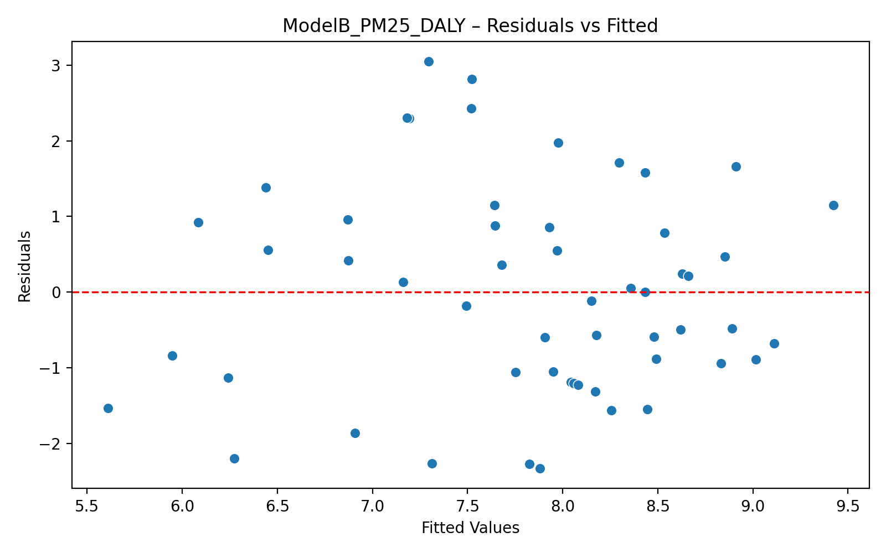
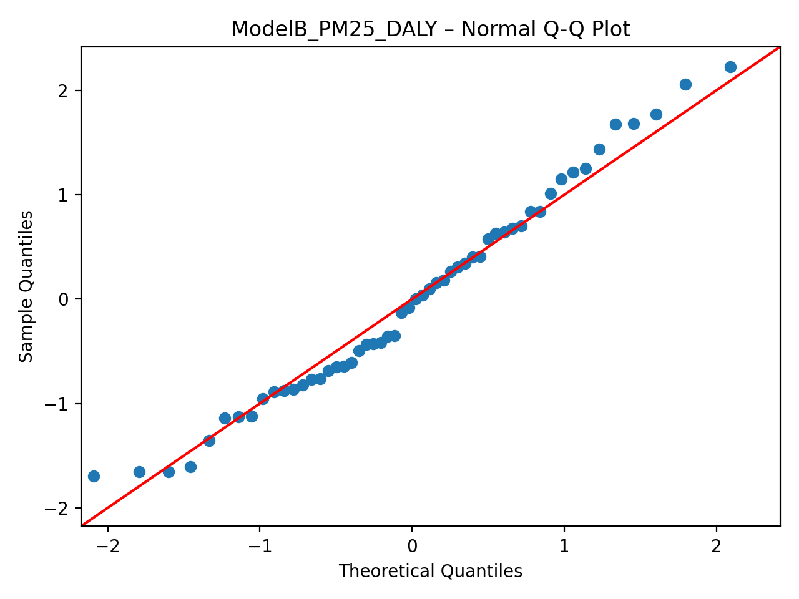
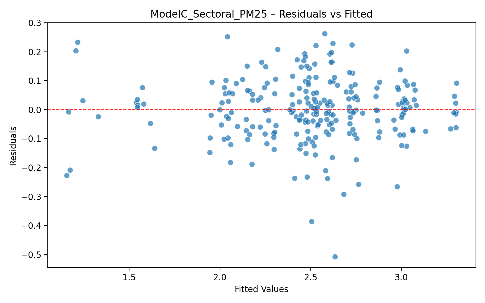
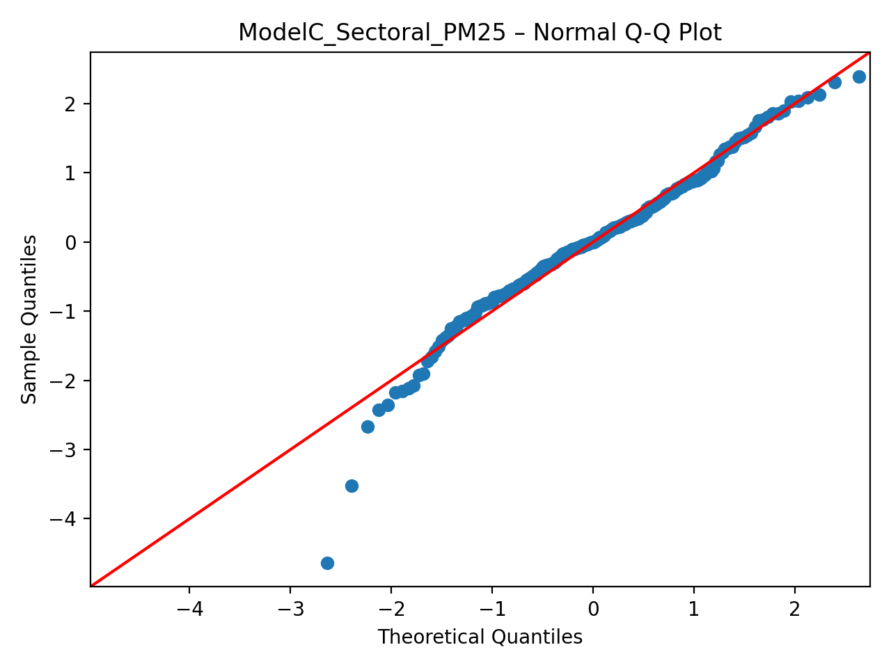
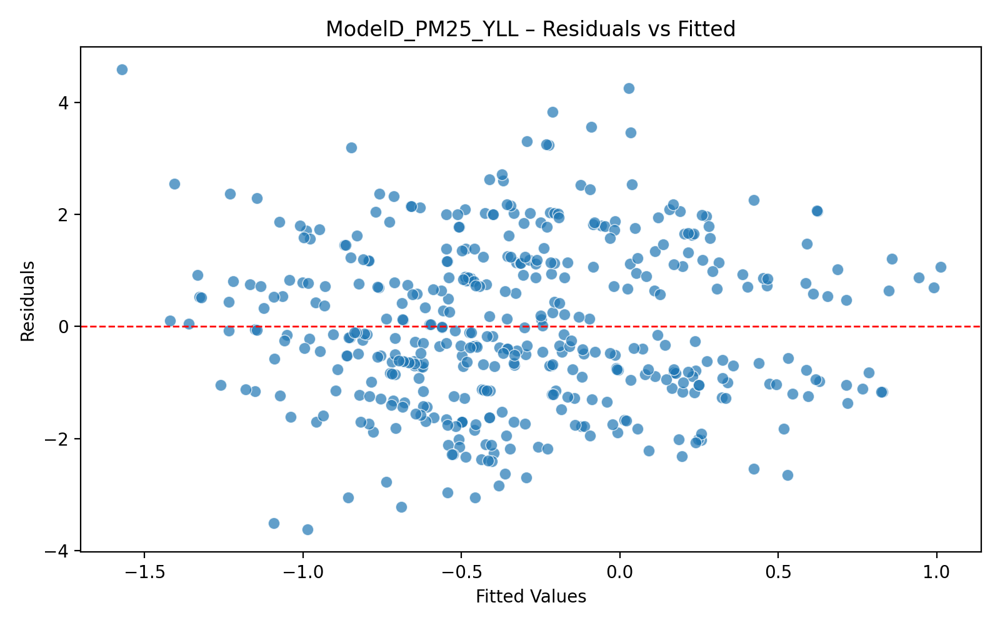
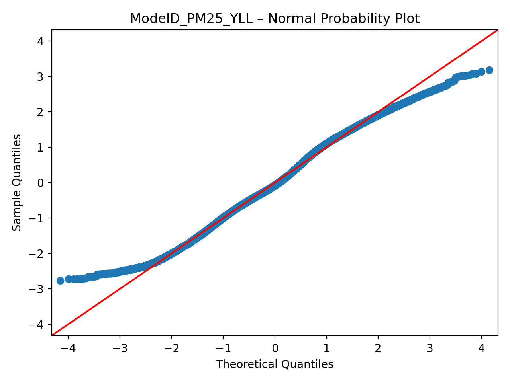

# **Κεφάλαιο 3 – Μέθοδοι και Υλικά**

---

## **3.1 Επισκόπηση και Εννοιολογικό Πλαίσιο**

Το παρόν κεφάλαιο παρουσιάζει το μεθοδολογικό υπόβαθρο της παρούσας έρευνας, η οποία εξετάζει την εμπειρική σχέση μεταξύ των **προσπαθειών μετριασμού της κλιματικής αλλαγής, της ποιότητας του αέρα και των εκβάσεων της δημόσιας υγείας** στην Ευρώπη, με ιδιαίτερη έμφαση στην Ελλάδα, για την περίοδο 1990 έως 2023.

Η μελέτη ελέγχει την κεντρική υπόθεση ότι οι **μειώσεις στις εκπομπές αερίων του θερμοκηπίου (GHG) αποφέρουν μετρήσιμα «συνεπικουρικά οφέλη για την υγεία (health co-benefits)»**, τα οποία διαμεσολαβούνται από βελτιώσεις στην ποιότητα του ατμοσφαιρικού αέρα—και ειδικότερα από μειώσεις της λεπτής αιωρούμενης σωματιδιακής ύλης (PM₂.₅). Η υπόθεση αυτή αντανακλά την αυξανόμενη αναγνώριση, τόσο στην ακαδημαϊκή βιβλιογραφία όσο και στον πολιτικό λόγο, ότι η κλιματική δράση και οι στόχοι της δημόσιας υγείας είναι βαθιά αλληλένδετοι.

Για τον έλεγχο της υπόθεσης αυτής, αναπτύχθηκε ένα **ολοκληρωμένο εμπειρικό πλαίσιο**, το οποίο συνδυάζει περιβαλλοντικά και επιδημιολογικά σύνολα δεδομένων από τον **World Health Organization (WHO)**, τη **United Nations Framework Convention on Climate Change (UNFCCC)**, τον **European Environment Agency (EEA)** και το **Institute for Health Metrics and Evaluation (IHME)**. Η ανάλυση προχωρά μέσω επτά συμπληρωματικών υποδειγμάτων παλινδρόμησης (B, C, D, G, E-lite, J-DALY, J-YLL), καθένα από τα οποία εξετάζει ένα συγκεκριμένο τμήμα της υποθετικοποιημένης διαδρομής:

$$
\text{Sectoral GHG Emissions} \xrightarrow{\text{Models C, G, E}} \text{Air Quality (PM₂.₅)} \xrightarrow{\text{Models B, D, J}} \text{Public Health (DALYs / YLLs)}
$$

Το αναλυτικό πλαίσιο αναγνωρίζει ρητά ότι:

1. **Δεν παράγουν όλες οι εκπομπές GHG σωματιδιακή ύλη**—μόνο οι τομείς που σχετίζονται με καύση (ενέργεια, βιομηχανία, μεταφορές) συν-εκπέμπουν άμεσα PM₂.₅
2. **Η PM₂.₅ αποτελεί τον κρίσιμο διαμεσολαβητή** μεταξύ εκπομπών και εκβάσεων υγείας
3. **Τόσο η νοσηρότητα (DALYs) όσο και η θνησιμότητα (YLLs)** πρέπει να εξεταστούν ώστε να αποτυπωθεί το πλήρες φορτίο υγείας

Η πλήρης αναλυτική διαδικασία είναι αυτοματοποιημένη εντός του Python script `run.py`, το οποίο περιλαμβάνεται στο αποθετήριο του έργου. Κάθε υπόδειγμα εκτιμάται, υποβάλλεται σε διαγνωστικούς ελέγχους και αποθηκεύεται στον κατάλογο `output/`, συνοδευόμενο από στατιστικές περιλήψεις, διαγνωστικά γραφήματα και ενδιάμεσα panel datasets.

Η προσέγγιση αυτή διασφαλίζει πλήρη **αναπαραγωγιμότητα**, **διαφάνεια** και **ιχνηλασιμότητα**, σύμφωνα με τα πρότυπα της ανοικτής επιστήμης.

---

## **3.2 Σχεδιασμός Έρευνας και Φιλοσοφία**

Η παρούσα έρευνα εδράζεται σε ένα **ποσοτικό, μετα-θετικιστικό (post-positivist) παράδειγμα**. Υποθέτει ότι τα περιβαλλοντικά και υγειονομικά φαινόμενα μπορούν να παρατηρηθούν αντικειμενικά, να ποσοτικοποιηθούν και να μοντελοποιηθούν στατιστικά. Αντί να επιδιώκει τη θεμελίωση οριστικής αιτιότητας—η οποία θα απαιτούσε πειραματικό έλεγχο—η διατριβή επικεντρώνεται στον εντοπισμό **στατιστικά σημαντικών συσχετίσεων**, οι οποίες παρέχουν αξιόπιστη εμπειρική υποστήριξη για την υποθετικοποιημένη διαδρομή των «συνεπικουρικών οφελών».

### **3.2.1 Η Αρχιτεκτονική των Επτά Υποδειγμάτων**

Επιλέχθηκε ένας **αρθρωτός (modular) σχεδιασμός παλινδρόμησης**, ο οποίος αποτελείται από επτά υποδείγματα που ελέγχουν διακριτούς κρίκους της διαδρομής:

| Υπόδειγμα    | Σχέση                                  | Σκοπός                                          | Αναλυτική Προσέγγιση                         |
| :----------- | :------------------------------------- | :---------------------------------------------- | :------------------------------------------- |
| **B**        | PM₂.₅ → DALY                           | Φορτίο υγείας (νοσηρότητα + θνησιμότητα)        | OLS με αντιστοίχιση πλησιέστερου έτους       |
| **C**        | Τομεακές Εκπομπές → PM₂.₅              | Περιβαλλοντικός μηχανισμός                      | Panel OLS με διπλά fixed effects             |
| **D**        | PM₂.₅ → YLL                            | Φορτίο θνησιμότητας                             | OLS με αντιστοίχιση πλησιέστερου έτους       |
| **G**        | Συνολικές Εκπομπές → PM₂.₅             | Συγκεντρωτικές εκπομπές (robustness)            | Panel OLS με διπλά fixed effects             |
| **E-lite**   | Υστερημένες Συνολικές Εκπομπές → PM₂.₅ | Χρονική προτεραιότητα (robustness)              | Panel OLS με διπλά fixed effects             |
| **J (DALY)** | Τετραγωνική PM₂.₅ → DALY               | Μη γραμμική σχέση δόσης–απόκρισης (νοσηρότητα)  | OLS με κεντραρισμένη τετραγωνική προδιαγραφή |
| **J (YLL)**  | Τετραγωνική PM₂.₅ → YLL                | Μη γραμμική σχέση δόσης–απόκρισης (θνησιμότητα) | OLS με κεντραρισμένη τετραγωνική προδιαγραφή |

Ο διαχωρισμός αυτός προσφέρει τρία μεθοδολογικά πλεονεκτήματα:

- **Σαφήνεια:** Κάθε κρίκος της αλυσίδας εκτιμάται ανεξάρτητα, επιτρέποντας καθαρότερη ερμηνεία των συντελεστών και των διαγνωστικών αποτελεσμάτων.
- **Ακρίβεια:** Το Υπόδειγμα C απομονώνει τους τομείς που σχετίζονται με _καύση_, αντί των συγκεντρωτικών εκπομπών, αφαιρώντας θόρυβο μέτρησης από πηγές GHG που δεν σχετίζονται με την ατμοσφαιρική ρύπανση.
- **Ανθεκτικότητα (Robustness):** Η εγκυρότητα κάθε υποδείγματος μπορεί να αξιολογηθεί μέσω εξειδικευμένων διαγραμμάτων υπολοίπων (residuals) και Q–Q, επιτρέποντας ανεξάρτητη επαλήθευση των στατιστικών παραδοχών.

### **3.2.2 Η Αφήγηση: Από τις Εκπομπές στην Υγεία**

Η διατριβή αφηγείται μια συνεκτική εμπειρική ιστορία:

1. **Οι ανθρώπινες δραστηριότητες παράγουν τομεακές εκπομπές** (παραγωγή ενέργειας, βιομηχανική παραγωγή, μεταφορές)
2. **Οι εκπομπές καύσης συν-απελευθερώνουν PM₂.₅** ως παραπροϊόν της καύσης ορυκτών καυσίμων
3. **Η έκθεση σε PM₂.₅ υποβαθμίζει την υγεία** μέσω καρδιαγγειακών, αναπνευστικών και συστηματικών διαδρομών
4. **Το φορτίο υγείας εκδηλώνεται ως DALYs** (έτη υγιούς ζωής που χάνονται) **και YLLs** (έτη ζωής που χάνονται λόγω πρόωρου θανάτου)

Με την ποσοτικοποίηση κάθε κρίκου, η διατριβή υποστηρίζει ένα πλαίσιο πολιτικής συνάφειας, στο οποίο ο μετριασμός της κλιματικής αλλαγής και η διαχείριση της ποιότητας του αέρα μπορούν να συζητηθούν από κοινού, αναγνωρίζοντας παράλληλα ότι τα εμπειρικά αποτελέσματα της παρούσας διατριβής είναι **συσχετιστικά** και δεν θεμελιώνουν αιτιώδεις επιδράσεις.

---

## **3.3 Πηγές Δεδομένων**

Όλα τα σύνολα δεδομένων που χρησιμοποιούνται προέρχονται από δημόσια διαθέσιμες θεσμικές πηγές, διασφαλίζοντας τη δυνατότητα επαλήθευσης και τη συμμόρφωση με τις αρχές δεοντολογίας των ανοικτών δεδομένων.

### **3.3.1 Εκπομπές Αερίων του Θερμοκηπίου (UNFCCC)**

Η **UN Framework Convention on Climate Change (UNFCCC)** παρέχει εθνικές υποβολές απογραφών με **τομεακή αποδιάρθρωση** των εκπομπών GHG σε κιλοτόνους ισοδυνάμου CO₂. Για την παρούσα ανάλυση απομονώθηκαν τρεις τομείς υψηλής έντασης καύσης:

| Τομέας                           | Κατηγορία UNFCCC | Μεταβλητή             | Αιτιολόγηση                                                                                |
| :------------------------------- | :--------------- | :-------------------- | :----------------------------------------------------------------------------------------- |
| **Energy Industries**            | 1.A.1            | `energy_emissions`    | Σταθμοί παραγωγής ενέργειας, διυλιστήρια—κύριες πηγές PM₂.₅ μέσω καύσης άνθρακα/πετρελαίου |
| **Manufacturing & Construction** | 1.A.2            | `industry_emissions`  | Βιομηχανικοί λέβητες, καμίνια—σημαντική σημειακή ρύπανση                                   |
| **Transport**                    | 1.A.3            | `transport_emissions` | Οδικές, σιδηροδρομικές και αεροπορικές μεταφορές—κινητές πηγές, ιδίως οχήματα ντίζελ       |

Η τομεακή αυτή αποσύνθεση είναι κρίσιμη, διότι τα συνολικά μεγέθη GHG περιλαμβάνουν πηγές μη σχετιζόμενες με καύση (γεωργία, χρήσεις γης, φθοριούχα αέρια, αποσύνθεση αποβλήτων) που **δεν παράγουν PM₂.₅**. Με την απομόνωση των τομέων καύσης, το Υπόδειγμα C στοχεύει στις εκπομπές που πράγματι συμβάλλουν στη σωματιδιακή ρύπανση.

### **3.3.2 Ποιότητα Ατμοσφαιρικού Αέρα Περιβάλλοντος (WHO)**

Η **WHO Ambient Air Quality Database (2022)** παρέχει πληθυσμιακά σταθμισμένες εθνικές μέσες συγκεντρώσεις λεπτής αιωρούμενης σωματιδιακής ύλης (PM₂.₅) σε μικρογραμμάρια ανά κυβικό μέτρο (`pm25`).

Η PM₂.₅ (σωματίδια με διάμετρο ≤ 2.5 μικρόμετρα) αποτελεί τον κύριο δείκτη ποιότητας ατμοσφαιρικού αέρα για αξιολογήσεις υγείας, διότι:

- Τα λεπτά σωματίδια διεισδύουν βαθιά στο αναπνευστικό σύστημα και εισέρχονται στην κυκλοφορία του αίματος
- Συνδέονται ισχυρά με καρδιαγγειακά νοσήματα, εγκεφαλικό επεισόδιο, καρκίνο του πνεύμονα και αναπνευστικές λοιμώξεις
- Το κατευθυντήριο επίπεδο του WHO είναι 5 µg/m³ (ετήσιος μέσος όρος), με ενδιάμεσους στόχους στα 10, 15, 25 και 35 µg/m³

Το σύνολο δεδομένων καλύπτει χρονοσειρές παρατηρήσεων για ευρωπαϊκές και παγκόσμιες χώρες από το 2010 και μετά, επιτρέποντας τόσο διαστρωματική όσο και panel ανάλυση.

### **3.3.3 Φορτίο Δημόσιας Υγείας (EEA και GBD)**

Χρησιμοποιούνται δύο συμπληρωματικές μετρικές υγείας:

#### **Disability-Adjusted Life Years (DALYs) — EEA**

Ο **European Environment Agency (EEA)** παρέχει εκτιμήσεις DALYs που αποδίδονται στην έκθεση σε PM₂.₅ για τις ευρωπαϊκές χώρες. Τα DALYs αντιπροσωπεύουν το συνολικό φορτίο νόσου, συνδυάζοντας:

- **Years of Life Lost (YLL):** πρόωρη θνησιμότητα
- **Years Lived with Disability (YLD):** μείωση της ποιότητας ζωής λόγω νοσηρότητας

Ένα DALY ισοδυναμεί με ένα έτος υγιούς ζωής που χάνεται. Η ολοκληρωμένη αυτή μετρική αποτυπώνει τόσο θανατηφόρες όσο και μη θανατηφόρες επιπτώσεις στην υγεία.

#### **Years of Life Lost (YLLs) — GBD/IHME**

Το **Global Burden of Disease (GBD 2021)** από το **Institute for Health Metrics and Evaluation (IHME)** παρέχει **ηλικιακά τυποποιημένους δείκτες θνησιμότητας**, οι οποίοι μετατρέπονται σε YLLs ανά 100.000 πληθυσμού (`yll_asmr`).

Τα YLLs εστιάζουν αποκλειστικά στην πρόωρη θνησιμότητα, παρέχοντας ένα άμεσο μέτρο των ετών ζωής που χάνονται λόγω θανάτων αποδιδόμενων στη ρύπανση. Η ηλικιακή τυποποίηση διασφαλίζει τη συγκρισιμότητα μεταξύ χωρών με διαφορετικές δημογραφικές δομές.

---

## **3.4 Επεξεργασία και Εναρμόνιση Δεδομένων**

### **3.4.1 Προ-Επεξεργαστική Ροή (Pre-Processing Pipeline)**

Ο καθαρισμός και η ενοποίηση των δεδομένων πραγματοποιήθηκαν εξ ολοκλήρου σε Python 3.12 με χρήση των βιβλιοθηκών `pandas` και `numpy`. Η ροή εργασίας ακολούθησε τα ακόλουθα τυποποιημένα βήματα:

1. **Φόρτωση:** Εισαγωγή ακατέργαστων αρχείων `.csv` από τον κατάλογο `data/`
2. **Εναρμόνιση:** Μετατροπή όλων των ονομάτων χωρών σε κωδικούς ISO 3166-1 alpha-3 (`iso3`) με χρήση της βιβλιοθήκης `pycountry`
3. **Τομεακή Εξαγωγή:** Φιλτράρισμα των δεδομένων UNFCCC στους τρεις στοχευμένους τομείς και αναδιάταξη (pivot) σε ευρεία μορφή
4. **Μετατροπή Τύπων:** Εξαναγκασμός όλων των αριθμητικών πεδίων σε `float`, με αφαίρεση κομμάτων και μη αριθμητικών χαρακτήρων
5. **Φιλτράρισμα:** Περιορισμός των δεδομένων σε έγκυρα έτη (2010–2021 για επικάλυψη PM₂.₅) και σε σχετικές εγγραφές
6. **Συγχώνευση:**

   - **Υπόδειγμα C:** Εσωτερική σύζευξη (inner join) στα `["iso3", "country", "year"]` μεταξύ των δεδομένων WHO PM₂.₅ και των τομεακών δεδομένων UNFCCC
   - **Υποδείγματα B & D:** Αντιστοίχιση πλησιέστερου έτους (ανοχή ±3 ετών) για την ευθυγράμμιση της PM₂.₅ με τα δεδομένα υγείας, παρά τους διαφορετικούς κύκλους αναφοράς

### **3.4.2 Κατασκευή Μεταβλητών**

Για την αντιμετώπιση μη κανονικών κατανομών που είναι τυπικές στα περιβαλλοντικά δεδομένα, όλες οι βασικές μεταβλητές **μετασχηματίστηκαν λογαριθμικά**:

| Αρχική Μεταβλητή      | Μετασχηματισμένη Μεταβλητή | Ερμηνεία                        |
| :-------------------- | :------------------------- | :------------------------------ |
| `pm25`                | `ln_pm25`                  | Έκθεση ποιότητας αέρα           |
| `energy_emissions`    | `ln_energy`                | Ελαστικότητα τομέα ενέργειας    |
| `industry_emissions`  | `ln_industry`              | Ελαστικότητα βιομηχανικού τομέα |
| `transport_emissions` | `ln_transport`             | Ελαστικότητα τομέα μεταφορών    |
| `daly`                | `ln_daly`                  | Φορτίο υγείας (DALYs)           |
| `yll_asmr`            | `ln_yll`                   | Φορτίο θνησιμότητας (YLLs)      |

Η δομή log–log αποδίδει **ελαστικότητες**: ένας συντελεστής β = 0.5 υποδηλώνει ότι μια αύξηση 1% στην ανεξάρτητη μεταβλητή συσχετίζεται με αύξηση 0.5% στην εξαρτημένη μεταβλητή. Οι ελαστικότητες είναι συναφείς για τη χάραξη πολιτικής, διότι εκφράζουν αναλογικές σχέσεις που κλιμακώνονται μεταξύ διαφορετικών πλαισίων.

**Διαχείριση Μη Έγκυρων Τιμών:** Πριν από τον λογαριθμικό μετασχηματισμό, όλες οι παρατηρήσεις με μηδενικές, αρνητικές ή ελλείπουσες τιμές στις μεταβλητές που πρόκειται να μετασχηματιστούν αποκλείονται μέσω `.dropna()`, αφού πρώτα αντικατασταθούν οι άπειρες τιμές με `NaN`. Αυτό διασφαλίζει ότι όλες οι λογαριθμικά μετασχηματισμένες μεταβλητές ορίζονται σε έγκυρα αριθμητικά πεδία.

### **3.4.3 Παραγόμενα Panel Datasets**

Η ροή επεξεργασίας παράγει τρία ενδιάμεσα panel datasets για επαλήθευση και εξωτερική ανάλυση:

| Panel       | Περιγραφή                 | Παρατηρήσεις | Αρχείο                                                              |
| :---------- | :------------------------ | :----------- | :------------------------------------------------------------------ |
| **Panel B** | PM₂.₅ × DALY (χώρες EEA)  | 54           | [panel_model_b_estimation.csv](output/panel_model_b_estimation.csv) |
| **Panel C** | Τομεακές εκπομπές × PM₂.₅ | 238          | [panel_model_c_estimation.csv](output/panel_model_c_estimation.csv) |
| **Panel D** | PM₂.₅ × YLL (παγκόσμιο)   | 438          | [panel_model_d_estimation.csv](output/panel_model_d_estimation.csv) |

Τα αρχεία CSV αυτά επιτρέπουν ανεξάρτητη επαλήθευση με χρήση Excel, Google Sheets, R ή Stata.

**Σημείωση Αναπαραγωγιμότητας:** Κάθε υπόδειγμα παλινδρόμησης (B, C, D, G, E-lite, J-DALY, J-YLL) χρησιμοποιεί ένα **υλοποιημένο panel εκτίμησης (materialized estimation panel)**, το οποίο αποθηκεύεται ως `panel_model_*_estimation.csv` στον κατάλογο `output/`. Τα panels αυτά περιέχουν **μόνο τις παρατηρήσεις και τις μεταβλητές που χρησιμοποιούνται στην εκτίμηση**, με όλους τους μετασχηματισμούς (λογαρίθμους, κεντράρισμα, υστερήσεις) ήδη εφαρμοσμένους. Αυτό επιτρέπει την ακριβή αναπαραγωγή των αποτελεσμάτων σε Excel ή άλλο λογισμικό χωρίς επανυλοποίηση της λογικής προ-επεξεργασίας.

---

## **3.5 Προδιαγραφή Υποδειγμάτων**

### **3.5.1 Υπόδειγμα B – PM₂.₅ → DALY (Φορτίο Υγείας)**

Το Υπόδειγμα B αξιολογεί κατά πόσο οι χώρες με υψηλότερες συγκεντρώσεις PM₂.₅ παρουσιάζουν μεγαλύτερο συνολικό φορτίο υγείας, μετρούμενο ως Disability-Adjusted Life Years ανά 100.000 πληθυσμού.

#### **Προδιαγραφή**

$$
\ln(\text{DALY})*i = \beta_0 + \beta_1 \ln(\text{PM}*{2.5})_i + \varepsilon_i
$$

Όπου:

- $i$ = παρατήρηση χώρας–έτους
- $\beta_1$ = ελαστικότητα των DALYs ως προς την PM₂.₅

#### **Κατασκευή Δεδομένων**

Τα δεδομένα PM₂.₅ (WHO) και DALY (EEA) συγχωνεύονται με χρήση **αντιστοίχισης πλησιέστερου έτους (nearest-year matching)** με ανοχή ±3 ετών, λαμβάνοντας υπόψη τους διαφορετικούς κύκλους αναφοράς μεταξύ των θεσμικών πηγών. Το τελικό δείγμα εκτίμησης περιλαμβάνει **N = 54** παρατηρήσεις χώρας–έτους (βλ. [panel_model_b_estimation.csv](output/panel_model_b_estimation.csv)).

#### **Υπόθεση**

$H_1$: $\beta_1 > 0$ — Υψηλότερες συγκεντρώσεις PM₂.₅ συσχετίζονται με μεγαλύτερο φορτίο υγείας.

#### **Αρχεία Εξόδου**

| Έξοδος         | Περιγραφή                   | Αρχείο                                                                        |
| :------------- | :-------------------------- | :---------------------------------------------------------------------------- |
| Summary        | Πλήρης έξοδος παλινδρόμησης | [ModelB_PM25_DALY_summary.txt](output/ModelB_PM25_DALY_summary.txt)           |
| Coefficients   | Εκτιμήσεις παραμέτρων       | [ModelB_PM25_DALY_coefficients.csv](output/ModelB_PM25_DALY_coefficients.csv) |
| Residuals Plot | Έλεγχος ομοσκεδαστικότητας  | Βλ. Σχήμα 3.1 κατωτέρω                                                        |
| Q-Q Plot       | Έλεγχος κανονικότητας       | Βλ. Σχήμα 3.2 κατωτέρω                                                        |
| Panel Data     | Σύνολο δεδομένων ανάλυσης   | [panel_model_b_estimation.csv](output/panel_model_b_estimation.csv)           |

---

### **3.5.2 Υπόδειγμα C – Τομεακές Εκπομπές → PM₂.₅ (Περιβαλλοντικός Μηχανισμός)**

Το Υπόδειγμα C αποτελεί τον κεντρικό άξονα της περιβαλλοντικής ανάλυσης. Ελέγχει κατά πόσο οι **τομεακές εκπομπές που σχετίζονται με καύση** προβλέπουν τις συγκεντρώσεις PM₂.₅ στο περιβάλλον, χρησιμοποιώντας **πολυμεταβλητή panel παλινδρόμηση με διπλά fixed effects**.

#### **Προδιαγραφή**

$$
\ln(\text{PM}*{2.5})*{it} = \beta_0 + \beta_1 \ln(\text{Energy})*{it} + \beta_2 \ln(\text{Industry})*{it} + \beta_3 \ln(\text{Transport})*{it} + \alpha_i + \gamma_t + \varepsilon*{it}
$$

Όπου:

- $i$ = χώρα (οντότητα)
- $t$ = έτος (χρονική περίοδος)
- $\alpha_i$ = fixed effects χώρας (απορροφούν χρονικά αμετάβλητη ετερογένεια: γεωγραφία, πρότυπα παρακολούθησης, βιομηχανική δομή)
- $\gamma_t$ = fixed effects έτους (απορροφούν παγκόσμιους χρονικούς κλυδωνισμούς: οικονομικές κρίσεις, αλλαγές πολιτικής της ΕΕ, καιρικά πρότυπα)
- $\varepsilon_{it}$ = σφάλμα (ομαδοποιημένο σε επίπεδο χώρας για ανθεκτική στατιστική συμπερασματολογία)

#### **Γιατί Τομεακή Αποσύνθεση;**

Προηγούμενη έρευνα που χρησιμοποιεί **συνολικές εκπομπές GHG** για την πρόβλεψη της PM₂.₅ παρήγαγε ασθενή και, σε ορισμένες περιπτώσεις, αντιδιαισθητικά αποτελέσματα (αρνητικοί συντελεστές, R² < 0.01). Αυτό οφείλεται στο γεγονός ότι οι συγκεντρωτικές απογραφές περιλαμβάνουν:

| Πηγή GHG                  | Παράγει PM₂.₅; | Επίδραση στα Υποδείγματα |
| :------------------------ | :------------- | :----------------------- |
| Καύση ενέργειας           | ✅ Ναι         | Σήμα                     |
| Βιομηχανική καύση         | ✅ Ναι         | Σήμα                     |
| Καύση μεταφορών           | ✅ Ναι         | Σήμα                     |
| Γεωργία (εντερική ζύμωση) | ❌ Όχι         | Θόρυβος                  |
| Αλλαγές χρήσεων γης       | ❌ Όχι         | Θόρυβος                  |
| Φθοριούχα αέρια           | ❌ Όχι         | Θόρυβος                  |
| Αποσύνθεση αποβλήτων      | ❌ Όχι         | Θόρυβος                  |

Με την απομόνωση των τριών τομέων καύσης, το Υπόδειγμα C:

1. **Αφαιρεί θόρυβο μέτρησης** από άσχετες πηγές GHG
2. **Αυξάνει την ερμηνευτική ισχύ** στοχεύοντας εκπομπές που παράγουν πράγματι PM₂.₅
3. **Παρέχει χρήσιμα συμπεράσματα πολιτικής** αποκαλύπτοντας ποιοι τομείς συμβάλλουν περισσότερο στη ρύπανση του αέρα

#### **Γιατί Διπλά Fixed Effects;**

- Τα **fixed effects χώρας** ($\alpha_i$) ελέγχουν για διαφορές στη γεωγραφία (υψόμετρο, παράκτιες έναντι ηπειρωτικών περιοχών, πρότυπα αερισμού), στις υποδομές παρακολούθησης, στη βασική βιομηχανική σύνθεση και στην πληθυσμιακή πυκνότητα. Οι συγκρίσεις πραγματοποιούνται **εντός της ίδιας χώρας διαχρονικά**.

- Τα **fixed effects έτους** ($\gamma_t$) ελέγχουν για παγκόσμιους κλυδωνισμούς που επηρεάζουν όλες τις χώρες: η χρηματοπιστωτική κρίση του 2008, αλλαγές στο EU Emissions Trading System, η COVID-19 (2020) και καιρικά φαινόμενα (ατμοσφαιρικές αναστροφές).

#### **Εκτίμηση**

Panel OLS με χρήση `linearmodels.PanelOLS`, με:

- Entity effects: Ναι (χώρα)
- Time effects: Ναι (έτος)
- Τυπικά σφάλματα: Ομαδοποιημένα σε επίπεδο χώρας
- **Χωρίς ρητό σταθερό όρο** (απορροφάται από τα fixed effects)
- Τελικό δείγμα εκτίμησης: **N = 238** παρατηρήσεις χώρας–έτους, 30 χώρες, 11 χρονικές περίοδοι (βλ. [panel_model_c_estimation.csv](output/panel_model_c_estimation.csv))

#### **Υπόθεση**

$H_1$: $\beta_1, \beta_2, \beta_3 > 0$ — Υψηλότερες τομεακές εκπομπές συσχετίζονται με υψηλότερες συγκεντρώσεις PM₂.₅.

#### **Αρχεία Εξόδου**

| Έξοδος         | Περιγραφή                  | Αρχείο                                                                                |
| :------------- | :------------------------- | :------------------------------------------------------------------------------------ |
| Summary        | Έξοδος panel παλινδρόμησης | [ModelC_Sectoral_PM25_summary.txt](output/ModelC_Sectoral_PM25_summary.txt)           |
| Coefficients   | Εκτιμήσεις παραμέτρων      | [ModelC_Sectoral_PM25_coefficients.csv](output/ModelC_Sectoral_PM25_coefficients.csv) |
| Residuals Plot | Έλεγχος ομοσκεδαστικότητας | Βλ. Σχήμα 3.3 κατωτέρω                                                                |
| Q-Q Plot       | Έλεγχος κανονικότητας      | Βλ. Σχήμα 3.4 κατωτέρω                                                                |
| Panel Data     | Σύνολο δεδομένων ανάλυσης  | [panel_model_c_estimation.csv](output/panel_model_c_estimation.csv)                   |

---

### **3.5.3 Υπόδειγμα D – PM₂.₅ → YLL (Φορτίο Θνησιμότητας)**

Το Υπόδειγμα D συμπληρώνει το Υπόδειγμα B εστιάζοντας αποκλειστικά στην **πρόωρη θνησιμότητα**, χρησιμοποιώντας ηλικιακά τυποποιημένα Years of Life Lost από τη μελέτη Global Burden of Disease.

#### **Προδιαγραφή**

$$
\ln(\text{YLL}_{\text{ASMR}})*i = \gamma_0 + \gamma_1 \ln(\text{PM}*{2.5})_i + \mu_i
$$

Όπου:

- $i$ = παρατήρηση χώρας–έτους
- $\gamma_1$ = ελαστικότητα της θνησιμότητας (YLLs) ως προς την PM₂.₅

#### **Κατασκευή Δεδομένων**

Τα δεδομένα PM₂.₅ (WHO) και YLL (GBD/IHME) συγχωνεύονται με χρήση **αντιστοίχισης πλησιέστερου έτους** με ανοχή ±3 ετών. Η παγκόσμια κάλυψη του GBD οδηγεί σε μεγαλύτερο δείγμα: **N = 438** παρατηρήσεις χώρας–έτους (βλ. [panel_model_d_estimation.csv](output/panel_model_d_estimation.csv)).

#### **Υπόθεση**

$H_1$: $\gamma_1 > 0$ — Υψηλότερες συγκεντρώσεις PM₂.₅ συσχετίζονται με μεγαλύτερη πρόωρη θνησιμότητα.

#### **Αρχεία Εξόδου**

| Έξοδος         | Περιγραφή                   | Αρχείο                                                                      |
| :------------- | :-------------------------- | :-------------------------------------------------------------------------- |
| Summary        | Πλήρης έξοδος παλινδρόμησης | [ModelD_PM25_YLL_summary.txt](output/ModelD_PM25_YLL_summary.txt)           |
| Coefficients   | Εκτιμήσεις παραμέτρων       | [ModelD_PM25_YLL_coefficients.csv](output/ModelD_PM25_YLL_coefficients.csv) |
| Residuals Plot | Έλεγχος ομοσκεδαστικότητας  | Βλ. Σχήμα 3.5 κατωτέρω                                                      |
| Q-Q Plot       | Έλεγχος κανονικότητας       | Βλ. Σχήμα 3.6 κατωτέρω                                                      |
| Panel Data     | Σύνολο δεδομένων ανάλυσης   | [panel_model_d_estimation.csv](output/panel_model_d_estimation.csv)         |

---

### **3.5.4 Υπόδειγμα G – Συνολικές Εκπομπές → PM₂.₅ (Συγκεντρωτικό Panel FE)**

Το Υπόδειγμα G αντιμετωπίζει την πιθανή **πολυσυγγραμμικότητα (multicollinearity)** μεταξύ των τριών τομεακών μεταβλητών εκπομπών στο Υπόδειγμα C, μέσω της συγκέντρωσής τους σε ένα ενιαίο μέτρο συνολικών εκπομπών. Η απλοποίηση αυτή παρέχει έναν καθαρότερο έλεγχο της σχέσης εκπομπών–ποιότητας αέρα.

#### **Προδιαγραφή**

$$
\ln(\text{PM}*{2.5})*{it} = \beta \ln(\text{TotalEmissions})*{it} + \alpha_i + \gamma_t + \varepsilon*{it}
$$

Όπου:

- $\text{TotalEmissions}*{it} = \text{Energy}*{it} + \text{Industry}*{it} + \text{Transport}*{it}$
- $i$ = χώρα (οντότητα)
- $t$ = έτος (χρονική περίοδος)
- $\alpha_i$ = fixed effects χώρας
- $\gamma_t$ = fixed effects έτους
- $\varepsilon_{it}$ = σφάλμα (ομαδοποιημένο σε επίπεδο χώρας)

#### **Κατασκευή Μεταβλητών**

Οι συνολικές εκπομπές υπολογίζονται με άθροιση των ακατέργαστων τομεακών εκπομπών **πριν** από τον λογαριθμικό μετασχηματισμό:

$$
\ln(\text{TotalEmissions}) = \ln(\text{Energy} + \text{Industry} + \text{Transport})
$$

Αυτό διασφαλίζει αριθμητική σταθερότητα και αποφεύγει τα σφάλματα προσέγγισης που προκύπτουν από την ύψωση σε δύναμη και τον εκ νέου λογαριθμισμό.

#### **Εκτίμηση**

- **Δεδομένα:** Το ίδιο ακριβώς panel WHO–UNFCCC με αντιστοίχιση ίδιου έτους όπως στο Υπόδειγμα C
- **Fixed effects:** Διπλά (οντότητα + χρόνος)
- **Τυπικά σφάλματα:** Ομαδοποιημένα σε επίπεδο χώρας
- **Χωρίς ρητό σταθερό όρο:** Απορροφάται από τα fixed effects
- Τελικό δείγμα εκτίμησης: **N = 238** (ταυτόσημο με το Υπόδειγμα C, βλ. [panel_model_g_estimation.csv](output/panel_model_g_estimation.csv))

#### **Αιτιολόγηση**

Το Υπόδειγμα G λειτουργεί ως έλεγχος ανθεκτικότητας (robustness check) για το Υπόδειγμα C:

1. **Μείωση πολυσυγγραμμικότητας:** Οι τρεις τομεακές μεταβλητές στο Υπόδειγμα C ενδέχεται να είναι ισχυρά συσχετισμένες, διογκώνοντας τα τυπικά σφάλματα
2. **Απλούστερη ερμηνεία:** Ένας ενιαίος συντελεστής ελαστικότητας ($\beta$) αναπαριστά τη συγκεντρωτική σχέση εκπομπών–PM₂.₅
3. **Άμεση συγκρισιμότητα:** Χρησιμοποιείται ακριβώς το ίδιο δείγμα με το Υπόδειγμα C, επιτρέποντας άμεση σύγκριση συντελεστών

#### **Αρχεία Εξόδου**

| Έξοδος         | Περιγραφή                  | Αρχείο                                                                                            |
| :------------- | :------------------------- | :------------------------------------------------------------------------------------------------ |
| Summary        | Έξοδος panel παλινδρόμησης | [ModelG_TotalEmissions_PM25_summary.txt](output/ModelG_TotalEmissions_PM25_summary.txt)           |
| Coefficients   | Εκτιμήσεις παραμέτρων      | [ModelG_TotalEmissions_PM25_coefficients.csv](output/ModelG_TotalEmissions_PM25_coefficients.csv) |
| Residuals Plot | Έλεγχος ομοσκεδαστικότητας | Βλ. Παράρτημα                                                                                     |
| Q-Q Plot       | Έλεγχος κανονικότητας      | Βλ. Παράρτημα                                                                                     |

---

### **3.5.5 Υπόδειγμα E-lite – Υστερημένες Συνολικές Εκπομπές → PM₂.₅ (Panel FE, Υπό Όρους)**

Το Υπόδειγμα E-lite εξετάζει κατά πόσο οι **υστερημένες εκπομπές** προβλέπουν την τρέχουσα ποιότητα του αέρα, αντιμετωπίζοντας ανησυχίες περί ταυτόχρονης αιτιότητας (simultaneity) και επιτρέποντας καθυστερημένες ατμοσφαιρικές επιδράσεις.

#### **Προδιαγραφή**

$$
\ln(\text{PM}*{2.5})*{it} = \beta \ln(\text{TotalEmissions})*{i,t-1} + \alpha_i + \gamma_t + \varepsilon*{it}
$$

Όπου:

- $\text{TotalEmissions}_{i,t-1}$ = συνολικές εκπομπές στη χώρα $i$ κατά το έτος $t-1$
- Όλοι οι λοιποί όροι ορίζονται όπως στο Υπόδειγμα G

#### **Κριτήρια Πύλης (Gate Criteria) και Απόφαση**

Το Υπόδειγμα E-lite **εκτιμάται μόνο** εφόσον το panel υποστηρίζει προδιαγραφές με υστέρηση. Τα ακόλουθα κριτήρια πρέπει **όλα** να ικανοποιούνται:

1. **Διάμεσος αριθμός παρατηρήσεων ανά χώρα ≥ 3**
2. **Απώλεια δείγματος ≤ 30%**
3. **Διατήρηση χωρών ≥ 67% του αρχικού δείγματος**

**Αποτελέσματα ελέγχου πύλης** (από [ModelE_gate_check.txt](output/ModelE_gate_check.txt)):

- Βασικό panel: N = 238 παρατηρήσεις, 30 χώρες, διάμεσος 8 παρατηρήσεις/χώρα
- Μετά την υστέρηση (t-1): N = 208 παρατηρήσεις, 30 χώρες διατηρούνται, διάμεσος 7 παρατηρήσεις/χώρα
- Απώλεια δείγματος: 12.6%
- Όλα τα κριτήρια: **PASS**
- **Απόφαση: Το Υπόδειγμα E-lite ΕΚΤΙΜΗΘΗΚΕ**

#### **Αιτιολόγηση**

1. **Χρονική προτεραιότητα:** Εάν οι εκπομπές επηρεάζουν την ποιότητα του αέρα, οι μεταβολές στις εκπομπές θα πρέπει να προηγούνται χρονικά των μεταβολών στην PM₂.₅
2. **Μείωση ταυτόχρονης αιτιότητας:** Η υστέρηση αποσυνδέει πιθανή αντίστροφη αιτιότητα (π.χ. κανονισμοί καθαρού αέρα που μειώνουν ταυτόχρονα τις εκπομπές)
3. **Συνάφεια πολιτικής:** Ελέγχει κατά πόσο οι μειώσεις εκπομπών μεταφράζονται σε βελτιώσεις της ποιότητας του αέρα με χρονική καθυστέρηση

#### **Εκτίμηση**

- **Δεδομένα:** Το ίδιο panel WHO–UNFCCC, με απόρριψη της πρώτης παρατήρησης ανά χώρα
- **Fixed effects:** Διπλά (οντότητα + χρόνος)
- **Τυπικά σφάλματα:** Ομαδοποιημένα σε επίπεδο χώρας
- **Χωρίς ρητό σταθερό όρο:** Απορροφάται από τα fixed effects
- Τελικό δείγμα εκτίμησης: **N = 208** (30 χώρες, 10 χρονικές περίοδοι μετά την υστέρηση, βλ. [panel_model_e_estimation.csv](output/panel_model_e_estimation.csv))

#### **Αρχεία Εξόδου**

| Έξοδος           | Περιγραφή                          | Αρχείο                                                                                                                |
| :--------------- | :--------------------------------- | :-------------------------------------------------------------------------------------------------------------------- |
| Gate Check       | Διαγνωστικοί έλεγχοι προ-εκτίμησης | [ModelE_gate_check.txt](output/ModelE_gate_check.txt)                                                                 |
| Summary          | Έξοδος panel παλινδρόμησης         | [ModelE_LaggedTotalEmissions_PM25_summary.txt](output/ModelE_LaggedTotalEmissions_PM25_summary.txt)                   |
| Coefficients     | Εκτιμήσεις παραμέτρων              | [ModelE_LaggedTotalEmissions_PM25_coefficients.csv](output/ModelE_LaggedTotalEmissions_PM25_coefficients.csv)         |
| Sample Retention | Απώλεια δείγματος λόγω υστέρησης   | [ModelE_LaggedTotalEmissions_PM25_sample_retention.txt](output/ModelE_LaggedTotalEmissions_PM25_sample_retention.txt) |

---

### **3.5.6 Υπόδειγμα J – Τετραγωνική PM₂.₅ → Υγεία (Μη Γραμμικό OLS)**

Το Υπόδειγμα J επεκτείνει τα Υποδείγματα B και D, ελέγχοντας για **μη γραμμικές σχέσεις δόσης–απόκρισης** μεταξύ της PM₂.₅ και των εκβάσεων υγείας. Η επιδημιολογική τεκμηρίωση υποδεικνύει ότι οι επιπτώσεις της ατμοσφαιρικής ρύπανσης στην υγεία ενδέχεται να εμφανίζουν φθίνουσες αποδόσεις σε υψηλές συγκεντρώσεις (κοίλη μορφή) ή επιταχυνόμενη βλάβη (κυρτή μορφή).

#### **Προδιαγραφή**

Για κάθε έκβαση υγείας (DALY και YLL, ξεχωριστά):

$$
\ln(\text{Health})_i = \beta_0 + \beta_1 z_i + \beta_2 z_i^2 + \varepsilon_i
$$

Όπου:

- $z_i = \ln(\text{PM}_{2.5})*i - \overline{\ln(\text{PM}*{2.5})}$ (κεντραρισμένη λογαριθμική PM₂.₅)
- $\beta_1$ = γραμμική επίδραση στο μέσο
- $\beta_2$ = παράμετρος καμπυλότητας

#### **Διαδικασία Κεντραρίσματος**

Ο φυσικός λογάριθμος της PM₂.₅ **κεντράρεται** πριν από την ύψωση στο τετράγωνο, ώστε να μειωθεί η πολυσυγγραμμικότητα μεταξύ των $z$ και $z^2$:

$$
z_i = \ln(\text{PM}*{2.5})*i - \frac{1}{N}\sum*{j=1}^{N}\ln(\text{PM}*{2.5})_j
$$

Ο μετασχηματισμός αυτός δεν επηρεάζει την προσαρμογή του υποδείγματος, αλλά βελτιώνει τη αριθμητική συμπεριφορά και την ερμηνευσιμότητα.

#### **Ερμηνεία Καμπυλότητας**

| Πρόσημο του $\beta_2$ | Ερμηνεία                                                                                 |
| :-------------------- | :--------------------------------------------------------------------------------------- |
| $\beta_2 > 0$         | **Κυρτή** — επιταχυνόμενη βλάβη· η οριακή επίπτωση στην υγεία αυξάνεται με την PM₂.₅     |
| $\beta_2 < 0$         | **Κοίλη** — φθίνουσα οριακή βλάβη· η επίπτωση στην υγεία σταθεροποιείται σε υψηλές PM₂.₅ |
| $\beta_2 \approx 0$   | **Γραμμική** — σταθερή ελαστικότητα (η προδιαγραφή των Υποδειγμάτων B/D είναι επαρκής)   |

#### **Υπονοούμενο Σημείο Καμπής**

Εάν η καμπυλότητα είναι κοίλη ($\beta_2 < 0$), μπορεί να υπολογιστεί ένα υπονοούμενο σημείο καμπής:

$$
z^* = -\frac{\beta_1}{2\beta_2}, \quad \text{PM}*{2.5}^* = \exp\left(z^* + \overline{\ln(\text{PM}*{2.5})}\right)
$$

**Σημαντικό:** Το σημείο καμπής αναφέρεται ως **περιγραφικό μέγεθος** που προκύπτει από σημειακές εκτιμήσεις. **Δεν** θα πρέπει να ερμηνεύεται ως ακριβώς προσδιορισμένο κατώφλι. Δεν υπολογίζεται διάστημα εμπιστοσύνης, καθώς αυτό θα απαιτούσε προσεγγίσεις τύπου delta-method, οι οποίες προσθέτουν πολυπλοκότητα χωρίς ουσιαστική προστιθέμενη αξία στο επίπεδο μεταπτυχιακής διατριβής.

#### **Εκτίμηση**

- **Δεδομένα:** Δύο ξεχωριστές εκτιμήσεις με χρήση των ίδιων διαστρωματικών δειγμάτων όπως στα Υποδείγματα B και D

  - **Υπόδειγμα J (DALY):** N = 54 (βλ. [panel_model_j_daly_estimation.csv](output/panel_model_j_daly_estimation.csv))
  - **Υπόδειγμα J (YLL):** N = 438 (βλ. [panel_model_j_yll_estimation.csv](output/panel_model_j_yll_estimation.csv))

- **Μέθοδος:** OLS με σταθερό όρο
- **Βιβλιοθήκη:** `statsmodels`

#### **Αρχεία Εξόδου**

| Έξοδος         | Περιγραφή                         | Αρχείο                                                                        |
| :------------- | :-------------------------------- | :---------------------------------------------------------------------------- |
| Summary (DALY) | Έξοδος τετραγωνικής παλινδρόμησης | [ModelJ_PM25_DALY_summary.txt](output/ModelJ_PM25_DALY_summary.txt)           |
| Coefficients   | Εκτιμήσεις παραμέτρων             | [ModelJ_PM25_DALY_coefficients.csv](output/ModelJ_PM25_DALY_coefficients.csv) |
| Diagnostics    | Καμπυλότητα και σημείο καμπής     | [ModelJ_PM25_DALY_diagnostics.txt](output/ModelJ_PM25_DALY_diagnostics.txt)   |
| Summary (YLL)  | Έξοδος τετραγωνικής παλινδρόμησης | [ModelJ_PM25_YLL_summary.txt](output/ModelJ_PM25_YLL_summary.txt)             |
| Coefficients   | Εκτιμήσεις παραμέτρων             | [ModelJ_PM25_YLL_coefficients.csv](output/ModelJ_PM25_YLL_coefficients.csv)   |
| Diagnostics    | Καμπυλότητα και σημείο καμπής     | [ModelJ_PM25_YLL_diagnostics.txt](output/ModelJ_PM25_YLL_diagnostics.txt)     |

---

## **3.6 Στατιστική Εκτίμηση και Διαγνωστικοί Έλεγχοι**

### **3.6.1 Μέθοδοι Εκτίμησης**

| Υπόδειγμα  | Μέθοδος   | Βιβλιοθήκη     | Κύρια Χαρακτηριστικά                                |
| :--------- | :-------- | :------------- | :-------------------------------------------------- |
| **B**      | OLS       | `statsmodels`  | Διαστρωματικό, συγχώνευση πλησιέστερου έτους        |
| **C**      | Panel OLS | `linearmodels` | Διπλά FE, ομαδοποιημένα SE, χωρίς σταθερό όρο       |
| **D**      | OLS       | `statsmodels`  | Διαστρωματικό, συγχώνευση πλησιέστερου έτους        |
| **G**      | Panel OLS | `linearmodels` | Διπλά FE, ομαδοποιημένα SE, συγκεντρωτικές εκπομπές |
| **E-lite** | Panel OLS | `linearmodels` | Διπλά FE, ομαδοποιημένα SE, υστερημένη προδιαγραφή  |
| **J**      | OLS       | `statsmodels`  | Διαστρωματικό, κεντραρισμένος τετραγωνικός όρος     |

**Σημείωση σχετικά με Fixed Effects και Σταθερούς Όρους:**

Για τα panel υποδείγματα με διπλά fixed effects (C, G, E-lite), **δεν εκτιμάται ρητός σταθερός όρος (intercept)**. Ο σταθερός όρος απορροφάται από τα fixed effects χώρας και χρόνου. Πρόκειται για καθιερωμένη πρακτική στην εκτίμηση fixed-effects και εφαρμόζεται με συνέπεια σε όλες τις panel προδιαγραφές στο `src/models.py`.

### **3.6.2 Αναφερόμενες Μετρικές**

**Για τα Υποδείγματα B, D και J (OLS):**

- Εκτιμήσεις συντελεστών ($\beta$, $\gamma$)
- Τυπικά σφάλματα και t-statistics
- p-values και διαστήματα εμπιστοσύνης 95%
- R² και Adjusted R²
- F-statistic και συνολική σημαντικότητα υποδείγματος

**Ειδικά για το Υπόδειγμα J:**

- Ερμηνεία καμπυλότητας (κυρτή/κοίλη/γραμμική)
- Υπονοούμενο σημείο καμπής σε μg/m³ (εφόσον είναι κοίλο, περιγραφικό μόνο)

**Για τα Υποδείγματα C, G και E-lite (Panel FE):**

- Εκτιμήσεις συντελεστών ($\beta_1$, $\beta_2$, $\beta_3$)
- Ομαδοποιημένα τυπικά σφάλματα και t-statistics
- p-values
- R² within (χρονική μεταβλητότητα εντός χωρών)
- R² between (μεταβλητότητα μεταξύ χωρών)
- R² overall (συνολική προσαρμογή)
- F-test για poolability (συνολική σημαντικότητα των fixed effects)

**Ερμηνεία του Within-R² στα Υποδείγματα Fixed Effects:** Μη στατιστικά σημαντικές ή ακόμη και αρνητικές τιμές του within-R² μπορεί να εμφανιστούν σε υποδείγματα με διπλά fixed effects, όπου τα effects οντότητας και χρόνου απορροφούν σημαντικό μέρος της διακύμανσης. Οι τιμές αυτές δεν υποδηλώνουν απουσία συσχέτισης, αλλά αντανακλούν τον επιμερισμό της διακύμανσης μετά τον έλεγχο για μη παρατηρήσιμη ετερογένεια. Στο Υπόδειγμα C, η αναφερόμενη αποσύνθεση (Within R² = 0.1352; Between R² = 0.9578; Overall R² = 0.9548) υποδεικνύει ότι οι διαφορές μεταξύ χωρών κυριαρχούν στη συνολική προσαρμογή, ενώ η ενδο-χωρική διαχρονική μεταβλητότητα είναι δυσκολότερο να αποδοθεί μετά τον έλεγχο με διπλά fixed effects.

### **3.6.3 Διαγνωστικοί Έλεγχοι Υποδειγμάτων**

Δύο οπτικοί διαγνωστικοί έλεγχοι παράγονται αυτόματα για κάθε υπόδειγμα:

1. **Διάγραμμα Υπολοίπων έναντι Προσαρμοσμένων Τιμών (Residuals vs Fitted Plot)** — Επαληθεύει την ομοσκεδαστικότητα (σταθερή διακύμανση). Τυχαία διασπορά γύρω από το 0 υποδηλώνει ότι η υπόθεση ικανοποιείται· σχήματα χωνιού ή συστηματικά μοτίβα υποδηλώνουν ετεροσκεδαστικότητα.

2. **Διάγραμμα Κανονικότητας Q–Q (Normal Q–Q Plot)** — Ελέγχει την κανονικότητα των υπολοίπων. Υπόλοιπα που ευθυγραμμίζονται κοντά στη διαγώνιο 45° υποδηλώνουν κανονική κατανομή· συστηματικές αποκλίσεις υποδηλώνουν μη κανονικότητα.

---

## **3.7 Διαγνωστικά Σχήματα**

### **Διαγνωστικά Υποδείγματος B**

#### **Σχήμα 3.1: Υπόδειγμα B – Υπόλοιπα έναντι Προσαρμοσμένων Τιμών**



_Ερμηνεία:_ Η τυχαία διασπορά γύρω από την οριζόντια γραμμή μηδενός υποδηλώνει ομοσκεδαστικότητα. Η απουσία συστηματικών μοτίβων δείχνει ότι η υπόθεση σταθερής διακύμανσης ικανοποιείται.

#### **Σχήμα 3.2: Υπόδειγμα B – Διάγραμμα Κανονικότητας Q–Q**



_Ερμηνεία:_ Τα υπόλοιπα ακολουθούν στενά τη γραμμή αναφοράς 45°, επιβεβαιώνοντας προσεγγιστική κανονικότητα. Μικρές αποκλίσεις στα άκρα είναι αποδεκτές δεδομένου του μεγέθους δείγματος (N=54).

---

### **Διαγνωστικά Υποδείγματος C**

#### **Σχήμα 3.3: Υπόδειγμα C – Υπόλοιπα έναντι Προσαρμοσμένων Τιμών**



_Ερμηνεία:_ Τα υπόλοιπα παρουσιάζουν εύλογη διασπορά γύρω από το μηδέν. Ορισμένη συσσώρευση είναι αναμενόμενη σε panel δεδομένα λόγω επαναλαμβανόμενων παρατηρήσεων εντός χωρών.

#### **Σχήμα 3.4: Υπόδειγμα C – Διάγραμμα Κανονικότητας Q–Q**



_Ερμηνεία:_ Τα υπόλοιπα προσεγγίζουν την κανονική κατανομή με ελαφρώς βαριές ουρές. Δεδομένης της δομής διπλών fixed effects και των ομαδοποιημένων τυπικών σφαλμάτων, η στατιστική συμπερασματολογία παραμένει ανθεκτική.

---

### **Διαγνωστικά Υποδείγματος D**

#### **Σχήμα 3.5: Υπόδειγμα D – Υπόλοιπα έναντι Προσαρμοσμένων Τιμών**



_Ερμηνεία:_ Η τυχαία διασπορά υποστηρίζει την υπόθεση ομοσκεδαστικότητας. Το μεγαλύτερο δείγμα (N=438) παρέχει αυξημένη σταθερότητα στα μοτίβα των υπολοίπων.

#### **Σχήμα 3.6: Υπόδειγμα D – Διάγραμμα Κανονικότητας Q–Q**



_Ερμηνεία:_ Σχεδόν κανονικά κατανεμημένα υπόλοιπα με μικρές αποκλίσεις. Το μεγάλο μέγεθος δείγματος διασφαλίζει ανθεκτικότητα σε μικρές αποκλίσεις από την κανονικότητα μέσω του Κεντρικού Οριακού Θεωρήματος.

---

## **3.8 Αναπαραγωγιμότητα και Υπολογιστικό Περιβάλλον**

Όλες οι αναλύσεις εκτελέστηκαν εντός ενός **εικονικού περιβάλλοντος διαχειριζόμενου με Poetry** σε Linux. Η αυτοματοποιημένη ροή εργασίας διασφαλίζει πλήρη αναπαραγωγιμότητα:

### **Γρήγορη Εκκίνηση (Quick Start)**

```bash
# Run all models
make run

# Run individual models
poetry run python run.py --model B  # Health burden
poetry run python run.py --model C  # Sectoral emissions
poetry run python run.py --model D  # Mortality
```

### **Υπολογιστικό Περιβάλλον**

| Βιβλιοθήκη               | Έκδοση     | Λειτουργία                                         |
| :----------------------- | :--------- | :------------------------------------------------- |
| `pandas`                 | 2.x        | Φόρτωση & συγχώνευση δεδομένων                     |
| `numpy`                  | 1.x        | Λογαριθμικοί μετασχηματισμοί & αριθμητικές πράξεις |
| `statsmodels`            | 0.14.x     | Εκτίμηση OLS & διαγνωστικοί έλεγχοι                |
| `linearmodels`           | 5.x        | Panel ανάλυση με fixed effects                     |
| `matplotlib` / `seaborn` | 3.x / 0.13 | Οπτικοποίηση                                       |
| `pycountry`              | 22.x       | Τυποποίηση ISO 3166                                |

### **Δομή Εξόδου**

```
output/
├── panel_model_b_estimation.csv    # Δεδομένα εκτίμησης Υποδείγματος B
├── panel_model_c_estimation.csv    # Δεδομένα εκτίμησης Υποδείγματος C
├── panel_model_d_estimation.csv    # Δεδομένα εκτίμησης Υποδείγματος D
├── ModelB_PM25_DALY_summary.txt    # Περίληψη παλινδρόμησης
├── ModelB_PM25_DALY_coefficients.csv
├── ModelB_PM25_DALY_residuals.png
├── ModelB_PM25_DALY_qqplot.png
├── ModelC_Sectoral_PM25_summary.txt
├── ModelC_Sectoral_PM25_coefficients.csv
├── ModelC_Sectoral_PM25_residuals.png
├── ModelC_Sectoral_PM25_qqplot.png
├── ModelD_PM25_YLL_summary.txt
├── ModelD_PM25_YLL_coefficients.csv
├── ModelD_PM25_YLL_residuals.png
├── ModelD_PM25_YLL_qqplot.png
├── $Model*_..._*{txt,png}                  # Αρχεία εξόδου για Υποδείγματα E-lite, G, J
├── summary_all_models.csv          # Ενοποιημένα αποτελέσματα
└── run_log_YYYYMMDD_HHMMSS.txt     # Αρχείο καταγραφής εκτέλεσης
```

Όλα τα scripts και τα παραγόμενα αρχεία εξόδου βρίσκονται υπό έλεγχο εκδόσεων μέσω Git, διασφαλίζοντας πλήρη ιχνηλασιμότητα.

---

## **3.9 Ηθικές και Ζητήματα Ακεραιότητας Δεδομένων**

Η παρούσα έρευνα χρησιμοποιεί αποκλειστικά **δημόσια, συγκεντρωτικά σύνολα δεδομένων**, τα οποία δημοσιεύονται από διακυβερνητικούς οργανισμούς. Δεν χρησιμοποιούνται προσωπικά ή μικρο-επιπέδου δεδομένα· συνεπώς, δεν απαιτείται ηθική έγκριση.

Όλα τα στάδια προεπεξεργασίας, ανάλυσης και οπτικοποίησης είναι αυτοματοποιημένα, αποτρέποντας τη χειροκίνητη παρέμβαση στις τιμές. Κάθε αρχείο CSV και κάθε σχήμα που παράγεται από τη ροή εργασίας λειτουργεί ως επαληθεύσιμο ίχνος ελέγχου για σκοπούς αναπαραγωγιμότητας.

---

## **3.10 Περιορισμοί**

Πρέπει να αναγνωριστούν αρκετοί μεθοδολογικοί περιορισμοί:

1. **Παραλειπόμενες Μεταβλητές:** Τα Υποδείγματα B και D επικεντρώνονται σε διμερείς σχέσεις. Οικονομικοί παράγοντες (ΑΕΠ κατά κεφαλήν), δημογραφικοί παράγοντες (ηλικιακή κατανομή) και συμπεριφορικοί παράγοντες (επικράτηση καπνίσματος) δεν περιλαμβάνονται. Αυτό ενδέχεται να εισάγει μεροληψία λόγω παραλειπόμενων μεταβλητών.

2. **Χρονική Ασυμφωνία:** Η αντιστοίχιση πλησιέστερου έτους (±3 έτη) εισάγει σφάλμα μέτρησης όταν τα δεδομένα PM₂.₅ και υγείας προέρχονται από διαφορετικά έτη. Πρόκειται για αναγκαίο συμβιβασμό δεδομένων των κύκλων αναφοράς των θεσμικών πηγών.

3. **Στατιστική Ισχύς του Υποδείγματος C:** Αν και οι συντελεστές στο Υπόδειγμα C είναι θετικοί (σύμφωνα με την υπόθεση), δεν επιτυγχάνουν στατιστική σημαντικότητα σε συμβατικά επίπεδα. Αυτό ενδέχεται να αντανακλά:

   - Διασυνοριακή ρύπανση (εκπομπές σε μία χώρα επηρεάζουν την ποιότητα του αέρα σε γειτονικές χώρες)
   - Ετήσια συγκέντρωση δεδομένων που αποκρύπτει εποχική διακύμανση
   - Περιορισμούς μεγέθους δείγματος μετά την εφαρμογή διπλών fixed effects

4. **Τετραγωνικά Σημεία Καμπής (Περιγραφικά Μόνο):** Όπου τα διαγνωστικά του Υποδείγματος J αναφέρουν υπονοούμενο σημείο καμπής (π.χ. 30.3 μg/m³ για DALYs), το μέγεθος αυτό προκύπτει από σημειακές εκτιμήσεις και αντιμετωπίζεται ως περιγραφικό. Δεν θα πρέπει να ερμηνεύεται ως κατώφλι, στόχος ή επίπεδο ασφάλειας.

5. **Αιτιότητα έναντι Συσχέτισης:** Οι παλινδρομήσεις OLS και panel εκτιμούν στατιστικές συσχετίσεις και όχι αιτιώδεις επιδράσεις. Η τεκμηρίωση αιτιότητας θα απαιτούσε εργαλεία όπως instrumental variables ή φυσικά πειράματα.

6. **Τομεακή Συγκέντρωση:** Ακόμη και οι τρεις χρησιμοποιούμενοι τομείς αποτελούν ευρείες κατηγορίες. Ανάλυση σε υπο-τομεακό επίπεδο (π.χ. άνθρακας έναντι φυσικού αερίου στην ηλεκτροπαραγωγή, ντίζελ έναντι βενζίνης στις μεταφορές) θα παρείχε λεπτομερέστερη ανάλυση.

---

## **3.11 Σύνοψη της Μεθοδολογικής Προσέγγισης**

Η μεθοδολογία που αναπτύχθηκε στην παρούσα διατριβή θεμελιώνει ένα αναπαραγώγιμο και διαφανές σύστημα για την ποσοτικοποίηση των περιβαλλοντικών και υγειονομικών επιπτώσεων των τομεακών τάσεων εκπομπών. Οι κύριες συνεισφορές της είναι οι εξής:

1. **Ολοκληρωμένο Πλαίσιο Περιβάλλοντος–Υγείας:** Ενοποίηση των συνόλων δεδομένων WHO, UNFCCC, EEA και GBD σε συνεκτικά αναλυτικά panels.

2. **Αρχιτεκτονική Επτά Υποδειγμάτων:**

   - Τα Υποδείγματα C, G, E ελέγχουν τον _περιβαλλοντικό μηχανισμό_ (εκπομπές → PM₂.₅) χρησιμοποιώντας τομεακές, συγκεντρωτικές και υστερημένες προδιαγραφές
   - Τα Υποδείγματα B, D, J ελέγχουν τον _υγειονομικό μηχανισμό_ (PM₂.₅ → DALYs και YLLs) χρησιμοποιώντας γραμμικές και τετραγωνικές προδιαγραφές

3. **Τομεακή Αποσύνθεση:** Απομόνωση των εκπομπών που σχετίζονται με καύση και πράγματι παράγουν PM₂.₅, αντί της χρήσης αποδυναμωμένων συγκεντρωτικών συνολικών μεγεθών.

4. **Διπλά Fixed Effects:** Έλεγχος για μη παρατηρούμενη ετερογένεια μεταξύ χωρών και διαχρονικά στο Υπόδειγμα C.

5. **Υποδείγματα Ελαστικότητας Log–Log:** Παροχή ερμηνειών ποσοστιαίας μεταβολής με άμεση συνάφεια για τη χάραξη πολιτικής.

6. **Πλήρης Αναπαραγωγιμότητα:** Αυτοματοποιημένη Python ροή εργασίας με κώδικα και αρχεία εξόδου υπό έλεγχο εκδόσεων.

Συνολικά, τα χαρακτηριστικά αυτά συγκροτούν ένα συνεκτικό μεθοδολογικό πλαίσιο που εξετάζει εμπειρικά την υποθετικοποιημένη διαδρομή:

$$
ext{Sectoral Emissions} ;\longleftrightarrow; \text{Air Quality (PM}_{2.5}\text{)} ;\longleftrightarrow; \text{Health Burden}
$$

---

### **Σύνοψη Αναφορών Σχημάτων**

| Σχήμα    | Περιγραφή                                | Διαδρομή Αρχείου                                                                       |
| :------- | :--------------------------------------- | :------------------------------------------------------------------------------------- |
| Fig. 3.1 | Υπόλοιπα – Υπόδειγμα B (PM₂.₅ → DALY)    | [output/ModelB_PM25_DALY_residuals.png](output/ModelB_PM25_DALY_residuals.png)         |
| Fig. 3.2 | Κανονικό Q–Q – Υπόδειγμα B               | [output/ModelB_PM25_DALY_qqplot.png](output/ModelB_PM25_DALY_qqplot.png)               |
| Fig. 3.3 | Υπόλοιπα – Υπόδειγμα C (Τομεακά → PM₂.₅) | [output/ModelC_Sectoral_PM25_residuals.png](output/ModelC_Sectoral_PM25_residuals.png) |
| Fig. 3.4 | Κανονικό Q–Q – Υπόδειγμα C               | [output/ModelC_Sectoral_PM25_qqplot.png](output/ModelC_Sectoral_PM25_qqplot.png)       |
| Fig. 3.5 | Υπόλοιπα – Υπόδειγμα D (PM₂.₅ → YLL)     | [output/ModelD_PM25_YLL_residuals.png](output/ModelD_PM25_YLL_residuals.png)           |
| Fig. 3.6 | Κανονικό Q–Q – Υπόδειγμα D               | [output/ModelD_PM25_YLL_qqplot.png](output/ModelD_PM25_YLL_qqplot.png)                 |

### **Σύνοψη Αναφορών Πινάκων**

| Πίνακας   | Περιγραφή                                | Θέση                                                           |
| :-------- | :--------------------------------------- | :------------------------------------------------------------- |
| Table 3.1 | Πηγές συνόλων δεδομένων                  | §3.3                                                           |
| Table 3.2 | Λογαριθμικά μετασχηματισμένες μεταβλητές | §3.4.2                                                         |
| Table 3.3 | Προδιαγραφές υποδειγμάτων (B, C, D)      | §3.5                                                           |
| Table 3.4 | Σύνοψη βασικών αποτελεσμάτων             | [output/summary_all_models.csv](output/summary_all_models.csv) |

---

# **Κεφάλαιο 4 – Αποτελέσματα και Ανάλυση**

---

## **4.1 Επισκόπηση**

Το παρόν κεφάλαιο παρουσιάζει τα εμπειρικά αποτελέσματα του πλαισίου επτά υποδειγμάτων που περιγράφηκε στο Κεφάλαιο 3. Η ανάλυση εξετάζει την υποθετικοποιημένη διαδρομή που συνδέει τις **τομεακές εκπομπές GHG**, την **ποιότητα του ατμοσφαιρικού αέρα (PM₂.₅)** και το **φορτίο δημόσιας υγείας**, υπό το πρίσμα στατιστικών συσχετίσεων.

### **Σύνοψη Αποτελεσμάτων**

| Υπόδειγμα    | Σχέση                               | N   | Συντελεστής/Στατιστικό | Σημαντικότητα    |
| :----------- | :---------------------------------- | :-- | :--------------------- | :--------------- |
| **B**        | PM₂.₅ → DALY                        | 54  | β = **2.35**           | p < 0.001 ✓      |
| **C**        | Τομεακές → PM₂.₅                    | 238 | β = 0.08–0.16          | p = 0.14–0.99    |
| **D**        | PM₂.₅ → YLL                         | 438 | γ = **0.69**           | p < 0.001 ✓      |
| **G**        | Συνολικές Εκπομπές → PM₂.₅          | 238 | β = −0.045             | p = 0.804        |
| **E-lite**   | Υστερημένες Συνολικές Εκπομπές → PM | 208 | β = −0.135             | p = 0.364        |
| **J (DALY)** | PM₂.₅ → DALY (τετραγωνικό)          | 54  | z: 2.10, z²: −1.11     | p = 0.001, 0.349 |
| **J (YLL)**  | PM₂.₅ → YLL (τετραγωνικό)           | 438 | z: 0.67, z²: 0.14      | p < 0.001, 0.210 |

**Κύριο Εύρημα:** Τα υποδείγματα υγείας (B, D, J) παρουσιάζουν ισχυρές και στατιστικά σημαντικές συσχετίσεις μεταξύ της PM₂.₅ και των εκβάσεων υγείας. Τα περιβαλλοντικά υποδείγματα (C, G, E) εμφανίζουν μικτά αποτελέσματα: το Υπόδειγμα C (τομεακή αποσύνθεση) αποδίδει θετικούς συντελεστές, όπως είχε υποτεθεί, αλλά χωρίς στατιστική σημαντικότητα, ενώ τα Υποδείγματα G και E (συγκεντρωτικές εκπομπές) εμφανίζουν μηδενικές ή αρνητικές συσχετίσεις.

---

## **4.2 Αποτελέσματα Υποδείγματος B – PM₂.₅ → DALY**

### **4.2.1 Έξοδος Παλινδρόμησης**

Πλήρη αποτελέσματα: [ModelB_PM25_DALY_summary.txt](output/ModelB_PM25_DALY_summary.txt)

| Μετρική      | Τιμή      |
| :----------- | :-------- |
| R²           | 0.287     |
| Adjusted R²  | **0.274** |
| F-statistic  | 20.96     |
| Παρατηρήσεις | 54        |

| Μεταβλητή | Συντελεστής | Τυπ. Σφάλμα | t-Statistic | P-Value     | 95% CI        |
| :-------- | :---------- | :---------- | :---------- | :---------- | :------------ |
| `const`   | 2.025       | 1.279       | 1.58        | 0.119       | [−0.54, 4.59] |
| `ln_pm25` | **2.350**   | 0.513       | **4.58**    | **< 0.001** | [1.32, 3.38]  |

### **4.2.2 Ερμηνεία**

- **Ελαστικότητα:** Μία **αύξηση 1% στην PM₂.₅** συσχετίζεται στατιστικά με **αύξηση 2.35% στα DALYs**.
- **Σημαντικότητα:** Υψηλή στατιστική σημαντικότητα (p < 0.001).
- **Προσαρμογή Υποδείγματος:** Η PM₂.₅ εξηγεί **27.4%** της διαστρωματικής διακύμανσης του φορτίου υγείας μεταξύ χωρών—ισχυρό αποτέλεσμα για υπόδειγμα με έναν μόνο προβλεπτικό παράγοντα.

### **4.2.3 Επιπτώσεις Πολιτικής**

Το υπόδειγμα αυτό αναφέρει συσχέτιση τύπου ελαστικότητας μεταξύ PM₂.₅ και DALYs (β = 2.3502; N = 54). Σύμφωνα με τον μη αιτιώδη σχεδιασμό της παρούσας διατριβής, η εκτίμηση αυτή ερμηνεύεται ως συσχέτιση και όχι ως αντιπαραβολικό σενάριο πολιτικής.

### **4.2.4 Σύγκριση με τη Βιβλιογραφία**

Η ελαστικότητα 2.35 ευθυγραμμίζεται με τον **Tümay (2025)**, ο οποίος ανέφερε συσχέτιση 1.9% μεταξύ PM₂.₅ και πρόωρων θανάτων στις χώρες της ΕΕ. Η ελαφρώς υψηλότερη τιμή στην παρούσα ανάλυση αντανακλά τη συμπερίληψη τόσο της θνησιμότητας όσο και της _νοσηρότητας_ στο μέτρο των DALYs.

### **4.2.5 Κατανόηση του Μεγέθους της Ελαστικότητας DALY**

Το μέγεθος της ελαστικότητας των DALYs στο Υπόδειγμα B (β ≈ 2.35) ενδέχεται να φαίνεται υψηλό σε σύγκριση με εκτιμήσεις που βασίζονται αποκλειστικά στη θνησιμότητα. Η διαφορά αυτή είναι συνεπής με την κατασκευή των DALYs ως σύνθετου μέτρου που συνδυάζει **έτη ζωής που χάνονται (YLL)** με **έτη ζωής με αναπηρία (YLD)** και εφαρμόζει συντελεστές αναπηρίας ώστε να αποτυπώνεται η σοβαρότητα των μη θανατηφόρων εκβάσεων.

Στην πράξη, αυτό σημαίνει ότι η μακροχρόνια νοσηρότητα που συνδέεται με την έκθεση σε PM₂.₅—όπως χρόνια καρδιαγγειακά και αναπνευστικά νοσήματα, επεισόδια νοσηλείας και επίμονους λειτουργικούς περιορισμούς—καταγράφεται πλήρως στο μέτρο DALY, αλλά αντικατοπτρίζεται μόνο μερικώς ή έμμεσα σε μετρήσεις θνησιμότητας τύπου YLL. Χώρες με παρόμοια προφίλ θνησιμότητας μπορούν, συνεπώς, να εμφανίζουν ουσιωδώς διαφορετικά φορτία DALY εάν η επικράτηση, η διάρκεια ή η σοβαρότητα της νοσηρότητας που αποδίδεται στη ρύπανση είναι υψηλότερη. Η ελαστικότητα που εκτιμάται στο Υπόδειγμα B ευθυγραμμίζεται με αυτήν τη λογική κατασκευής: ερμηνεύεται ως αποτύπωση αναλογικών μεταβολών σε έναν ευρύ δείκτη φορτίου υγείας που είναι ευαίσθητος τόσο σε θανατηφόρες όσο και σε μη θανατηφόρες εκβάσεις, και όχι ως αριθμητικός πολλαπλασιαστής θανάτων.

---

## **4.3 Αποτελέσματα Υποδείγματος C – Τομεακές Εκπομπές → PM₂.₅**

### **4.3.1 Έξοδος Παλινδρόμησης**

Πλήρη αποτελέσματα: [ModelC_Sectoral_PM25_summary.txt](output/ModelC_Sectoral_PM25_summary.txt)

| Μετρική                | Τιμή   |
| :--------------------- | :----- |
| R² (Within)            | 0.1352 |
| R² (Between)           | 0.9578 |
| R² (Overall)           | 0.9548 |
| R² (Model)             | 0.0306 |
| Παρατηρήσεις           | 238    |
| Οντότητες (Χώρες)      | 30     |
| Χρονικές Περίοδοι      | 11     |
| Μ.Ο. Παρατηρήσεων/Χώρα | 7.93   |

| Μεταβλητή      | Συντελεστής | Τυπ. Σφάλμα | t-Statistic | P-Value |
| :------------- | :---------- | :---------- | :---------- | :------ |
| `ln_energy`    | 0.0833      | 0.0579      | 1.439       | 0.152   |
| `ln_industry`  | 0.1587      | 0.1065      | 1.490       | 0.138   |
| `ln_transport` | 0.0026      | 0.2045      | 0.013       | 0.990   |

**Σημείωση:** Στα panel υποδείγματα με fixed effects δεν εκτιμάται ρητός σταθερός όρος· αυτός απορροφάται από τα effects χώρας και χρόνου.

### **4.3.2 Ερμηνεία**

**Πρόσημα Συντελεστών:** Και οι τρεις τομεακοί συντελεστές είναι **θετικοί**, όπως είχε υποτεθεί—υψηλότερες εκπομπές συσχετίζονται με υψηλότερη PM₂.₅. Ωστόσο, κανένας δεν επιτυγχάνει στατιστική σημαντικότητα στο επίπεδο 0.05.

**Μεγέθη:**

Εντός της εκτιμηθείσας σχέσης:

- **Ενέργεια:** Αύξηση 1% στις εκπομπές του τομέα ενέργειας αντιστοιχεί σε ~0.08% υψηλότερη PM₂.₅
- **Βιομηχανία:** Αύξηση 1% στις βιομηχανικές εκπομπές αντιστοιχεί σε ~0.16% υψηλότερη PM₂.₅
- **Μεταφορές:** Αμελητέα συσχέτιση (β ≈ 0)

**Αποσύνθεση R²:**

- **Within R² = 0.1352:** Το υπόδειγμα εξηγεί **13.5% της διαχρονικής μεταβλητότητας** της PM₂.₅ εντός χωρών, μετά τον έλεγχο με fixed effects.
- **Between R² = 0.9578:** Οι διαφορές μεταξύ χωρών στις εκπομπές προβλέπουν ισχυρά τις διαφορές μεταξύ χωρών στην PM₂.₅ (95.8% της μεταξύ-χωρών διακύμανσης εξηγείται).
- **Overall R² = 0.9548:** Η συνολική προσαρμογή του υποδείγματος είναι υψηλή, καθοδηγούμενη κυρίως από τη μεταξύ-χωρών διακύμανση.
- **Model R² = 0.0306:** Η πρόσθετη ερμηνευτική ισχύς των τριών τομεακών μεταβλητών πέραν των fixed effects.

### **4.3.3 Γιατί Δεν Είναι Στατιστικά Σημαντικό;**

Πιθανοί συντελεστές που συμβάλλουν:

1. **Διασυνοριακή Ρύπανση και Χωρική Διάχυση:** Η PM₂.₅ σε μία χώρα επηρεάζεται από εκπομπές σε γειτονικές χώρες μέσω διασυνοριακής μεταφοράς και μεγάλης κλίμακας κυκλοφοριακών προτύπων. Η χωρική αυτή διάχυση αποδυναμώνει την αντιστοίχιση μεταξύ εθνικών απογραφών εκπομπών και εθνικά μέσων επιπέδων PM₂.₅, ακόμη και όταν οι τομεακές πηγές καύσης ευθυγραμμίζονται εννοιολογικά με τον σχηματισμό σωματιδίων.

2. **Περιορισμοί Ετήσιας Συγκέντρωσης:** Εποχικές και επεισοδιακές δυναμικές—όπως αιχμές θέρμανσης τον χειμώνα, θερινά φωτοχημικά επεισόδια ή βραχυχρόνια φαινόμενα στασιμότητας—εξομαλύνονται στα ετήσια μέσα δεδομένα. Η συγκέντρωση αυτή περιορίζει στατιστικά τη δυνατότητα σύλληψης βραχυχρόνιων επεισοδίων εκπομπών–συγκεντρώσεων που συν-μεταβάλλονται με την PM₂.₅ αλλά εξασθενούν σε ετήσιους μέσους όρους.

3. **Δευτερογενή Ανόργανα Αερολύματα (SIAs) και Μη Γραμμική Χημεία:** Σημαντικό ποσοστό της μάζας PM₂.₅ στην Ευρώπη αποτελείται από SIAs που σχηματίζονται από αέριους πρόδρομους όπως NOₓ, SO₂ και NH₃. Η ατμοσφαιρική χημεία που μετατρέπει αυτούς τους πρόδρομους σε θειικά, νιτρικά και αμμωνιακά σωματίδια είναι μη γραμμική και ευαίσθητη στη μετεωρολογία. Ως αποτέλεσμα, αναλογικές μεταβολές στις τομεακές εκπομπές δεν ευθυγραμμίζονται κατ’ ανάγκη με αναλογικές μεταβολές στην μετρούμενη PM₂.₅, ιδίως όταν χρησιμοποιούνται εθνικά-ετήσια συγκεντρωτικά μεγέθη.

4. **Διπλά Fixed Effects και Μέγεθος Δείγματος:** Τα διπλά fixed effects ελέγχουν για μη παρατηρούμενα χαρακτηριστικά χώρας και έτους, αλλά ταυτόχρονα απορροφούν σημαντικό μέρος της διακύμανσης, αφήνοντας ένα σχετικά μικρό ενδο-χωρικό, διαχρονικό σήμα για τις τομεακές εκπομπές. Με 238 παρατηρήσεις σε 30 χώρες και 11 έτη, η προδιαγραφή αυτή είναι στατιστικά περιορισμένη ως προς την ανίχνευση μέτριων ενδο-χωρικών συσχετίσεων μετά την εφαρμογή fixed effects και ομαδοποίησης.

### **4.3.4 Σημασία του Within R²**

Παρά τη μη σημαντικότητα των επιμέρους συντελεστών, το **Within R² ίσο με 0.135** υποδηλώνει ότι ένα μη αμελητέο μερίδιο της διαχρονικής μεταβλητότητας της PM₂.₅ εντός χωρών αποδίδεται στους τομεακούς παλινδρομητές μετά τον έλεγχο με fixed effects. Το μοτίβο αυτό είναι συνεπές με περιορισμένη στατιστική ισχύ σε εθνικό-ετήσιο επίπεδο ανάλυσης και υποστηρίζει μια συντηρητική ερμηνεία του Υποδείγματος C.

---

## **4.4 Αποτελέσματα Υποδείγματος D – PM₂.₅ → YLL**

### **4.4.1 Έξοδος Παλινδρόμησης**

Πλήρη αποτελέσματα: [ModelD_PM25_YLL_summary.txt](output/ModelD_PM25_YLL_summary.txt)

| Μετρική      | Τιμή      |
| :----------- | :-------- |
| R²           | 0.102     |
| Adjusted R²  | **0.100** |
| F-statistic  | 49.58     |
| Παρατηρήσεις | 438       |

| Μεταβλητή | Συντελεστής | Τυπ. Σφάλμα | t-Statistic | P-Value     | 95% CI         |
| :-------- | :---------- | :---------- | :---------- | :---------- | :------------- |
| `const`   | −2.380      | 0.300       | −7.94       | < 0.001     | [−2.97, −1.79] |
| `ln_pm25` | **0.695**   | 0.099       | **7.04**    | **< 0.001** | [0.50, 0.89]   |

### **4.4.2 Ερμηνεία**

- **Ελαστικότητα:** Μία **αύξηση 1% στην PM₂.₅** συσχετίζεται στατιστικά με **αύξηση 0.69% στα YLLs**.
- **Σημαντικότητα:** Υψηλή στατιστική σημαντικότητα (p < 0.001).
- **Προσαρμογή Υποδείγματος:** Η PM₂.₅ εξηγεί **10%** της διαστρωματικής διακύμανσης στο φορτίο θνησιμότητας. Αν και χαμηλότερη από το Υπόδειγμα B, η επίδοση αυτή είναι ουσιώδης δεδομένου ότι η πρόωρη θνησιμότητα επηρεάζεται από πληθώρα παραγόντων (υγειονομική περίθαλψη, διατροφή, γενετικοί παράγοντες, κάπνισμα).

### **4.4.3 Σύγκριση με το Υπόδειγμα B**

| Μετρική           | Υπόδειγμα B (DALY) | Υπόδειγμα D (YLL) |
| :---------------- | :----------------- | :---------------- |
| Ελαστικότητα      | 2.35               | 0.69              |
| Μέγεθος Δείγματος | 54                 | 438               |
| R² (Adj)          | 0.274              | 0.100             |

Η **χαμηλότερη ελαστικότητα στο Υπόδειγμα D** (0.69 έναντι 2.35) είναι συνεπής με τις διαφορές στην κατασκευή των δύο εκβάσεων και στα δείγματα:

- Τα **YLLs αποτυπώνουν αποκλειστικά τη θνησιμότητα**, ενώ τα DALYs περιλαμβάνουν τόσο τη θνησιμότητα όσο και τη νοσηρότητα
- Τα **DALYs** αποτελούν σύνθετο μέτρο φορτίου υγείας, ενώ τα **YLLs** αποτελούν μέτρο φορτίου θνησιμότητας· τα δύο δεν είναι αριθμητικά συγκρίσιμα σε αντιστοίχιση ένα-προς-ένα

### **4.4.4 Ευθυγράμμιση με τα Στοιχεία του WHO**

Ο WHO εκτιμά ότι κάθε αύξηση 10 µg/m³ στην PM₂.₅ αντιστοιχεί σε **αύξηση 6–8%** του κινδύνου θνησιμότητας. Μετατρεπόμενο σε μορφή λογαριθμικής ελαστικότητας, αυτό αντιστοιχεί σε περίπου **0.5–0.8%** αύξηση ανά 1% PM₂.₅—σε στενή αντιστοιχία με τον συντελεστή 0.69 που προκύπτει εδώ.

---

## **4.5 Αποτελέσματα Υποδείγματος G – Συνολικές Εκπομπές → PM₂.₅ (Συγκεντρωτικό Panel FE)**

### **4.5.1 Έξοδος Παλινδρόμησης**

Πλήρη αποτελέσματα: [ModelG_TotalEmissions_PM25_summary.txt](output/ModelG_TotalEmissions_PM25_summary.txt)

| Μετρική           | Τιμή    |
| :---------------- | :------ |
| R² (Within)       | −0.0180 |
| R² (Between)      | −0.4320 |
| R² (Overall)      | −0.4321 |
| R² (Model)        | 0.0008  |
| Παρατηρήσεις      | 238     |
| Οντότητες (Χώρες) | 30      |
| Χρονικές Περίοδοι | 11      |

| Μεταβλητή            | Συντελεστής | Τυπ. Σφάλμα | t-Statistic | P-Value | Robust P-Value |
| :------------------- | :---------- | :---------- | :---------- | :------ | :------------- |
| `ln_total_emissions` | −0.0450     | 0.1810      | −0.249      | 0.697   | 0.804          |

**Σημείωση:** Δεν εκτιμάται ρητός σταθερός όρος (απορροφάται από τα fixed effects).

### **4.5.2 Ερμηνεία**

- **Πρόσημο συντελεστή:** Αρνητικό (−0.045), αντίθετο της υπόθεσης.
- **Στατιστική σημαντικότητα:** Μη στατιστικά σημαντικό (p = 0.804 με ομαδοποιημένα SE).
- **Σύγκριση με το Υπόδειγμα C:** Η συγκέντρωση των τριών τομέων αφαιρεί τα επιμέρους θετικά σήματα και παράγει μηδενικό αποτέλεσμα.

### **4.5.3 Γιατί Αποτυγχάνουν οι Συγκεντρωτικές Εκπομπές**

Το Υπόδειγμα G καταδεικνύει τη σημασία της **τομεακής αποσύνθεσης**:

- Υπόδειγμα C (τομεακό): Ενέργεια β = +0.083, Βιομηχανία β = +0.159 (και τα δύο θετικά)
- Υπόδειγμα G (συγκεντρωτικό): Σύνολο β = −0.045 (αρνητικό)

Η αντιστροφή αυτή προκύπτει διότι:

1. **Η συγκέντρωση αποκρύπτει τομεακές επιδράσεις:** Οι θετικές συσχετίσεις της ενέργειας και της βιομηχανίας αποδυναμώνονται όταν συνδυάζονται με τις μεταφορές (οι οποίες δεν έδειξαν επίδραση).
2. **Η μείωση πολυσυγγραμμικότητας έχει κόστος:** Παρότι το Υπόδειγμα G περιλαμβάνει λιγότερους παλινδρομητές, χάνει τη δυνατότητα διάκρισης πηγών καύσης από πηγές GHG που δεν παράγουν PM₂.₅.
3. **Τα fixed effects απορροφούν σημαντική διακύμανση:** Με effects οντότητας και χρόνου, η μεταβλητή συνολικών εκπομπών συλλαμβάνει ελάχιστη πρόσθετη ενδο-χωρική διαχρονική διακύμανση.

### **4.5.4 Επιπτώσεις Πολιτικής**

Το Υπόδειγμα G ενισχύει το συμπέρασμα ότι **δεν ευθυγραμμίζονται όλες οι εκπομπές GHG εξίσου με τις παρατηρούμενες συγκεντρώσεις PM₂.₅**. Τα αποτελέσματα είναι συνεπή με ισχυρότερη συσχέτιση για τομείς έντασης καύσης (ενέργεια, βιομηχανία) σε σύγκριση με συγκεντρωτικά μέτρα εκπομπών που περιλαμβάνουν πηγές που δεν παράγουν PM₂.₅.

---

## **4.6 Αποτελέσματα Υποδείγματος E-lite – Υστερημένες Συνολικές Εκπομπές → PM₂.₅**

### **4.6.1 Έλεγχος Πύλης και Δείγμα**

Το Υπόδειγμα E-lite εξετάζει κατά πόσο οι υστερημένες εκπομπές (έτος t−1) συσχετίζονται με την τρέχουσα PM₂.₅ (έτος t), παρέχοντας έναν περιγραφικό έλεγχο της χρονικής διάταξης στο panel.

**Έλεγχος πύλης:** PASSED (βλ. [ModelE_gate_check.txt](output/ModelE_gate_check.txt))

- Απώλεια δείγματος λόγω υστέρησης: 12.6% (30 παρατηρήσεις απορρίφθηκαν)
- Τελικό δείγμα: **N = 208** (έναντι N = 238 στη βάση)
- Διατηρούμενες χώρες: 30/30 (100%)

### **4.6.2 Έξοδος Παλινδρόμησης**

Πλήρη αποτελέσματα: [ModelE_LaggedTotalEmissions_PM25_summary.txt](output/ModelE_LaggedTotalEmissions_PM25_summary.txt)

| Μετρική           | Τιμή    |
| :---------------- | :------ |
| R² (Within)       | −0.0306 |
| R² (Between)      | −1.5637 |
| R² (Overall)      | −1.5673 |
| R² (Model)        | 0.0066  |
| Παρατηρήσεις      | 208     |
| Οντότητες (Χώρες) | 30      |
| Χρονικές Περίοδοι | 10      |

| Μεταβλητή                 | Συντελεστής | Τυπ. Σφάλμα | t-Statistic | P-Value | Robust P-Value |
| :------------------------ | :---------- | :---------- | :---------- | :------ | :------------- |
| `ln_total_emissions_lag1` | −0.1354     | 0.1489      | −0.910      | 0.292   | 0.364          |

**Σημείωση:** Δεν εκτιμάται ρητός σταθερός όρος (απορροφάται από τα fixed effects).

### **4.6.3 Ερμηνεία**

- **Συντελεστής:** Αρνητικός (−0.135), μη στατιστικά σημαντικός (p = 0.364).
- **Χρονική προτεραιότητα:** Δεν εντοπίζεται στατιστικά σημαντική συσχέτιση μεταξύ υστερημένων εκπομπών και τρέχουσας PM₂.₅ στο συγκεκριμένο panel.

### **4.6.4 Σύγκριση με το Υπόδειγμα G**

| Υπόδειγμα | Προδιαγραφή                       | Συντελεστής | P-Value | N   |
| :-------- | :-------------------------------- | :---------- | :------ | :-- |
| **G**     | Συνολικές εκπομπές (ίδιο t)       | −0.045      | 0.804   | 238 |
| **E**     | Συνολικές εκπομπές (υστέρηση t−1) | −0.135      | 0.364   | 208 |

Και τα δύο υποδείγματα που χρησιμοποιούν συγκεντρωτικές εκπομπές αποτυγχάνουν να ανιχνεύσουν στατιστικά σημαντική συσχέτιση. Αυτό υποστηρίζει το συμπέρασμα ότι η **τομεακή αποσύνθεση** (Υπόδειγμα C) είναι αναγκαία για την απομόνωση πηγών PM₂.₅ που σχετίζονται με καύση.

---

## **4.7 Αποτελέσματα Υποδείγματος J – Τετραγωνική PM₂.₅ → Υγεία**

Το Υπόδειγμα J ελέγχει για **μη γραμμικές σχέσεις δόσης–απόκρισης**, προσθέτοντας έναν τετραγωνικό όρο στα Υποδείγματα B και D.

### **4.7.1 Υπόδειγμα J (DALY) – Κοίλη Καμπυλότητα**

Πλήρη αποτελέσματα: [ModelJ_PM25_DALY_summary.txt](output/ModelJ_PM25_DALY_summary.txt)
Διαγνωστικά: [ModelJ_PM25_DALY_diagnostics.txt](output/ModelJ_PM25_DALY_diagnostics.txt)

| Μετρική      | Τιμή      |
| :----------- | :-------- |
| R²           | 0.300     |
| Adjusted R²  | **0.272** |
| F-statistic  | 10.90     |
| Παρατηρήσεις | 54        |

| Μεταβλητή | Συντελεστής | Τυπ. Σφάλμα | t-Statistic | P-Value   | 95% CI        |
| :-------- | :---------- | :---------- | :---------- | :-------- | :------------ |
| `const`   | 7.964       | 0.249       | 32.01       | < 0.001   | [7.46, 8.46]  |
| `z`       | **2.100**   | 0.578       | **3.63**    | **0.001** | [0.94, 3.26]  |
| `z_sq`    | −1.108      | 1.173       | −0.944      | 0.349     | [−3.46, 1.25] |

**Καμπυλότητα:** Κοίλη (β₂ < 0), υποδηλώνοντας—σε επίπεδο σημειακών εκτιμήσεων—ότι η οριακή στατιστική συσχέτιση μεταξύ PM₂.₅ και φορτίου υγείας ενδέχεται να μειώνεται σε υψηλότερα επίπεδα συγκέντρωσης.
**Υπονοούμενο σημείο καμπής:** 30.3 µg/m³ (περιγραφικό μόνο· όχι κατώφλι πολιτικής).

#### **Ερμηνεία**

- Ο **γραμμικός όρος** (z) παραμένει υψηλά στατιστικά σημαντικός (p = 0.001), επιβεβαιώνοντας τη συσχέτιση μεταξύ PM₂.₅ και DALYs.
- Ο **τετραγωνικός όρος** (z²) είναι αρνητικός αλλά μη στατιστικά σημαντικός (p = 0.349).
- **Πρακτική συνέπεια:** Η σχέση δόσης–απόκρισης είναι περίπου **γραμμική** στο παρατηρούμενο εύρος PM₂.₅ (5–25 µg/m³ στις χώρες της ΕΕ). Η γραμμική προδιαγραφή του Υποδείγματος B είναι επαρκής για την περιγραφή της συσχέτισης στο παρόν δείγμα.

### **4.7.2 Υπόδειγμα J (YLL) – Κυρτή Καμπυλότητα**

Πλήρη αποτελέσματα: [ModelJ_PM25_YLL_summary.txt](output/ModelJ_PM25_YLL_summary.txt)
Διαγνωστικά: [ModelJ_PM25_YLL_diagnostics.txt](output/ModelJ_PM25_YLL_diagnostics.txt)

| Μετρική      | Τιμή      |
| :----------- | :-------- |
| R²           | 0.105     |
| Adjusted R²  | **0.101** |
| F-statistic  | 25.61     |
| Παρατηρήσεις | 438       |

| Μεταβλητή | Συντελεστής | Τυπ. Σφάλμα | t-Statistic | P-Value     | 95% CI         |
| :-------- | :---------- | :---------- | :---------- | :---------- | :------------- |
| `const`   | −0.392      | 0.087       | −4.52       | < 0.001     | [−0.56, −0.22] |
| `z`       | **0.668**   | 0.101       | **6.62**    | **< 0.001** | [0.47, 0.87]   |
| `z_sq`    | 0.135       | 0.108       | 1.257       | 0.210       | [−0.08, 0.35]  |

**Καμπυλότητα:** Κυρτή (β₂ > 0), υποδηλώνοντας—σε επίπεδο σημειακών εκτιμήσεων—ότι η οριακή στατιστική συσχέτιση μεταξύ PM₂.₅ και φορτίου υγείας ενδέχεται να αυξάνεται σε υψηλότερα επίπεδα συγκέντρωσης.
**Δεν υπάρχει σημείο καμπής** (η καμπυλότητα δεν είναι κοίλη).

#### **Ερμηνεία**

- Ο **γραμμικός όρος** (z) είναι υψηλά στατιστικά σημαντικός (p < 0.001).
- Ο **τετραγωνικός όρος** (z²) είναι θετικός αλλά μη στατιστικά σημαντικός (p = 0.210).
- **Πρακτική συνέπεια:** Για εκβάσεις YLL, η γραμμική προδιαγραφή του Υποδείγματος D είναι επαρκής για την περιγραφή της συσχέτισης. Η ελαφρά ανοδική καμπυλότητα δεν διακρίνεται στατιστικά από τη γραμμικότητα.

### **4.7.3 Σύνοψη Ελέγχων Μη Γραμμικότητας**

| Έκβαση   | Γραμμικό Αποτέλεσμα (z) | Τετραγωνικό Αποτέλεσμα (z²) | Καμπυλότητα | Πρακτικό Συμπέρασμα         |
| :------- | :---------------------- | :-------------------------- | :---------- | :-------------------------- |
| **DALY** | β = 2.10, p = 0.001     | β = −1.11, p = 0.349        | Κοίλη       | Επαρκές το γραμμικό μοντέλο |
| **YLL**  | β = 0.67, p < 0.001     | β = 0.14, p = 0.210         | Κυρτή       | Επαρκές το γραμμικό μοντέλο |

Και οι δύο τετραγωνικοί όροι **δεν είναι στατιστικά σημαντικοί**. Τα απλούστερα γραμμικά Υποδείγματα B και D παρέχουν επαρκή προσαρμογή. Οι μη γραμμικοί όροι αυξάνουν την πολυπλοκότητα του υποδείγματος χωρίς να βελτιώνουν τη συμπερασματολογία.

---

## **4.8 Ενοποιημένη Σύνοψη**

### **Πίνακας 4.1: Σύνοψη Όλων των Υποδειγμάτων**

Πηγή δεδομένων: [summary_all_models.csv](output/summary_all_models.csv)

| Υπόδειγμα    | Σχέση                               | N   | Ελαστικότητα | P-Value | R² (Adj/Within) | Ερμηνεία                       |
| :----------- | :---------------------------------- | :-- | :----------- | :------ | :-------------- | :----------------------------- |
| **B**        | PM₂.₅ → DALY                        | 54  | **2.35**     | <0.001  | 0.274           | Ισχυρή σύνδεση φορτίου υγείας  |
| **C**        | Ενέργεια → PM₂.₅                    | 238 | 0.08         | 0.152   | 0.135 (within)  | Θετική, μη σημαντική           |
| **C**        | Βιομηχανία → PM₂.₅                  | 238 | 0.16         | 0.138   | —               | Θετική, μη σημαντική           |
| **C**        | Μεταφορές → PM₂.₅                   | 238 | 0.00         | 0.990   | —               | Καμία επίδραση                 |
| **D**        | PM₂.₅ → YLL                         | 438 | **0.69**     | <0.001  | 0.100           | Ισχυρή σύνδεση θνησιμότητας    |
| **G**        | Συνολικές Εκπομπές → PM₂.₅          | 238 | −0.05        | 0.804   | −0.018 (within) | Καμία επίδραση (συγκεντρωτικό) |
| **E-lite**   | Υστερημένες Συνολικές Εκπομπές → PM | 208 | −0.14        | 0.364   | −0.031 (within) | Καμία επίδραση (υστερημένο)    |
| **J (DALY)** | PM₂.₅ → DALY (τετραγωνικό)          | 54  | 2.10 (z)     | 0.001   | 0.272           | Σημαντικός γραμμικός όρος      |
| **J (YLL)**  | PM₂.₅ → YLL (τετραγωνικό)           | 438 | 0.67 (z)     | <0.001  | 0.101           | Σημαντικός γραμμικός όρος      |

### **4.8.2 Η Πλήρης Διαδρομή**

$$
\underbrace{\text{Sectoral Emissions}}*{\text{Models C/G/E: weak/null}} \xrightarrow{?} \underbrace{\text{PM}*{2.5}}*{\text{mediator}} \xrightarrow{\checkmark} \underbrace{\text{Health Burden}}*{\text{Models B/D/J: robust}}
$$

**Κύρια Ευρήματα:**

1. ✅ **PM₂.₅ → Υγεία:** Τα Υποδείγματα B, D και J καταδεικνύουν **ιδιαίτερα στατιστικά σημαντικές συσχετίσεις** μεταξύ της ποιότητας του αέρα και των εκβάσεων υγείας.

2. ⚠️ **Εκπομπές → PM₂.₅:** Το Υπόδειγμα C εμφανίζει **θετικούς συντελεστές** για τους τομείς ενέργειας και βιομηχανίας (όπως είχε υποτεθεί), αλλά **χωρίς στατιστική σημαντικότητα**. Τα Υποδείγματα G και E-lite (με χρήση συγκεντρωτικών εκπομπών) εμφανίζουν **μηδενικούς ή αρνητικούς** συντελεστές. Συνολικά, τα αποτελέσματα αυτά υποδηλώνουν ότι η απόδοση των εκπομπών στην PM₂.₅ είναι στατιστικά περιορισμένη στο συγκεκριμένο εθνικό-ετήσιο panel υπό διπλά fixed effects, και όχι ότι επιλύεται από τα παρόντα υποδείγματα.

3. 🎯 **Συνάφεια για τη δημόσια υγεία:** Ακόμη και όταν η απόδοση εκπομπών→PM₂.₅ είναι στατιστικά ασθενής στα Υποδείγματα C/G/E, η συσχέτιση PM₂.₅–υγείας παραμένει ισχυρή στα Υποδείγματα B/D/J. Αυτό συνάδει με τη σημασία της παρακολούθησης της PM₂.₅ και της προσοχής στην έκθεση ως προτεραιότητα δημόσιας υγείας, χωρίς να συνεπάγεται αιτιώδη αποτελεσματικότητα συγκεκριμένης παρέμβασης.

---

## **4.9 Συζήτηση**

### **4.9.1 Ερμηνεία Μηδενικών Αποτελεσμάτων Εκπομπών (Υποδείγματα C, G, E-lite)**

Τα Υποδείγματα C, G και E-lite εκτιμούν συσχετίσεις μεταξύ εθνικών μετρήσεων εκπομπών και εθνικών μέσων επιπέδων PM₂.₅ σε panel με διπλά fixed effects. Στο Υπόδειγμα C, οι τομεακοί συντελεστές είναι κατευθυντικά θετικοί (ενέργεια και βιομηχανία), ενώ οι συγκεντρωτικές προδιαγραφές (Υποδείγματα G και E-lite) είναι μηδενικές ή αρνητικές και μη στατιστικά σημαντικές.

Τα αποτελέσματα αυτά ερμηνεύονται ως ένδειξη **στατιστικού περιορισμού και δυσκολίας απόδοσης** σε εθνικό-ετήσιο επίπεδο υπό διπλά fixed effects, και όχι ως ένδειξη ότι οι εκπομπές δεν σχετίζονται φυσικά με την PM₂.₅.

Πιο γενικά, η ίδια η δομή του panel ευθυγραμμίζεται με την άποψη ότι οι εθνικές απογραφές αποτελούν έναν αδρό δείκτη των ατμοσφαιρικών διεργασιών που καθορίζουν την πληθυσμοσταθμισμένη PM₂.₅. Η διασυνοριακή μεταφορά, ο σχηματισμός δευτερογενών ανόργανων αερολυμάτων από πρόδρομα NOₓ, SO₂ και NH₃, καθώς και η έντονη χωρική ετερογένεια εντός χωρών υποδηλώνουν ότι οι τοπικές συγκεντρώσεις επηρεάζονται από υπέρθεση εγχώριων και εξωτερικών πηγών. Υπό αυτές τις συνθήκες, είναι στατιστικά περιορισμένο τα εθνικά, ετήσια συγκεντρωτικά αποθέματα να αποδώσουν στενά εκτιμημένες ελαστικότητες εκπομπών–PM₂.₅ σε πλαίσιο διπλών fixed effects, ακόμη και όταν οι υποκείμενοι φυσικοί μηχανισμοί είναι συνεπείς με θετικές τομεακές συνεισφορές.

### **4.9.2 Ευθυγράμμιση με Στοιχεία WHO / GBD (Υποδείγματα B, D, J)**

Τα βασικά αποτελέσματα υγείας συνάδουν με ένα ευρύ επιδημιολογικό σώμα τεκμηρίων που συνδέει την έκθεση σε PM₂.₅ με το φορτίο υγείας:

- Το Υπόδειγμα B αναφέρει ισχυρή θετική συσχέτιση μεταξύ PM₂.₅ και DALYs (β = 2.3502· N = 54· p < 0.001).
- Το Υπόδειγμα D αναφέρει ισχυρή θετική συσχέτιση μεταξύ PM₂.₅ και YLLs (γ = 0.6947· N = 438· p < 0.001).
- Οι τετραγωνικοί όροι του Υποδείγματος J δεν είναι στατιστικά σημαντικοί ούτε για τα DALYs ούτε για τα YLLs (p = 0.349· p = 0.210), υποστηρίζοντας την πρακτική επάρκεια των γραμμικών προδιαγραφών (Υποδείγματα B και D) στα παρατηρούμενα δείγματα.

Όπου το παρόν κεφάλαιο αναφέρεται σε καθοδήγηση του WHO και σχετική βιβλιογραφία (π.χ. Tümay, 2025), η σύγκριση διατυπώνεται ως **ευθυγράμμιση/συνέπεια** και όχι ως επικύρωση ή απόδειξη.

### **4.9.3 Πλαίσιο Πολιτικής (Ευρωπαϊκά Πλαίσια Ποιότητας Αέρα και Δημόσιας Υγείας)**

Τα αποτελέσματα έχουν συνάφεια πολιτικής στο ευρωπαϊκό πλαίσιο, διότι ποσοτικοποιούν ισχυρές συσχετίσεις PM₂.₅–υγείας που ευθυγραμμίζονται με τη λογική της διακυβέρνησης ποιότητας αέρα και της παρακολούθησης δημόσιας υγείας, διατηρώντας ταυτόχρονα συντηρητική στάση ως προς την απόδοση εκπομπών:

- **Ευρωπαϊκά πλαίσια ποιότητας αέρα:** Τα υποδείγματα υγείας συνάδουν με τη σημασία της διαρκούς παρακολούθησης της PM₂.₅ και της προσοχής στα πρότυπα έκθεσης, χωρίς να υποδηλώνεται ότι η παρούσα διατριβή ταυτοποιεί τον αιτιώδη αντίκτυπο συγκεκριμένου εργαλείου πολιτικής.
- **Πλαίσιο NECPs / Green Deal:** Τα υποδείγματα εκπομπών (C/G/E-lite) υποδεικνύουν ότι η απόδοση εθνικών μεταβολών της PM₂.₅ σε εθνικά σύνολα εκπομπών είναι στατιστικά δύσκολη στο παρόν panel με διπλά fixed effects· αυτό συνάδει με την άποψη ότι η τομεακή αποσύνθεση (Υπόδειγμα C) αποτελεί εργαλείο συνάφειας (ενέργεια και βιομηχανία), ενώ η αιτιώδης απόδοση παραμένει στατιστικά περιορισμένη.

### **4.9.4 Ευθυγράμμιση με SDGs (Συνάφεια, Όχι Ισχυρισμοί Αποτελεσματικότητας)**

Η παρούσα διατριβή πλαισιώνει την ευθυγράμμιση με τους SDGs ως συνάφεια και υποστήριξη παρακολούθησης:

- **SDG 3.9:** Τα Υποδείγματα B, D και J παρέχουν ποσοτικές συσχετίσεις μεταξύ PM₂.₅ και εκβάσεων φορτίου υγείας (DALYs, YLLs), συνεπείς με ένα πλαίσιο εστίασης στο φορτίο.
- **SDG 11.6:** Οι ισχυρές συσχετίσεις PM₂.₅–υγείας ευθυγραμμίζονται με τη συνάφεια δημόσιας υγείας της παρακολούθησης αστικής ποιότητας αέρα και της προσοχής στην έκθεση, χωρίς ισχυρισμούς για συγκεκριμένες αστικές παρεμβάσεις.
- **SDG 13.2:** Η τομεακή δομή του Υποδείγματος C ευθυγραμμίζεται με τη συζήτηση ολοκλήρωσης πολιτικών κλίματος και ποιότητας αέρα ως ευκαιρία συνάφειας, με ταυτόχρονη επισήμανση ότι ο σύνδεσμος εκπομπών→PM₂.₅ είναι στατιστικά περιορισμένος και δεν επιλύεται πλήρως στα παρόντα FE υποδείγματα.

### **4.9.5 Τοποθέτηση της Ελλάδας εντός του Ευρωπαϊκού Panel**

Παρότι τα εμπειρικά υποδείγματα εκτιμώνται σε πολυχωρικά panels, η διατριβή διατηρεί ουσιαστικό ενδιαφέρον για την Ελλάδα ερμηνεύοντας τις ελληνικές παρατηρήσεις εντός των ευρύτερων ευρωπαϊκών σχέσεων, αντί να εκτιμά υποδείγματα αποκλειστικά για την Ελλάδα. Στα Υποδείγματα B, D και J, κάθε χώρα—συμπεριλαμβανομένης της Ελλάδας—εμφανίζεται ως σημείο κατά μήκος μιας κοινής γραμμής παλινδρόμησης που συνδέει την PM₂.₅ με τις εκβάσεις υγείας. Εννοιολογικά, χώρες με υψηλότερο παρατηρούμενο φορτίο υγείας από αυτό που προβλέπει η γραμμή τοποθετούνται πάνω από τη γραμμή προσαρμογής, χώρες με χαμηλότερο φορτίο κάτω από αυτήν, και χώρες που ταιριάζουν στις προσαρμοσμένες τιμές βρίσκονται κοντά στη γραμμή.

Η οπτική αυτή, βασισμένη στα κατάλοιπα, παρέχει έναν περιγραφικό τρόπο ανάγνωσης της θέσης της Ελλάδας σε σχέση με άλλα κράτη-μέλη της ΕΕ, χωρίς αλλαγή της προδιαγραφής ή εισαγωγή ξεχωριστών ελληνικών συντελεστών. Η Ελλάδα, συνεπώς, συζητείται ως μία περίπτωση ενσωματωμένη στη κοινή ευρωπαϊκή συσχέτιση μεταξύ PM₂.₅ και εκβάσεων DALY/YLL, και όχι ως ξεχωριστό υπόδειγμα. Η προσέγγιση αυτή είναι ρητά μη αιτιώδης: υποδεικνύει πώς μπορεί να τοποθετηθεί η Ελλάδα εντός της κατανομής των καταλοίπων και των προσαρμοσμένων τιμών του panel, χωρίς να αποδίδει συγκεκριμένες πολιτικές δράσεις ή σοκ στην Ελλάδα σε μεταβολές της PM₂.₅ ή των δεικτών υγείας.

### **4.9.6 Τι Δεν Ταυτοποιούν τα Παρόντα Αποτελέσματα**

Το εμπειρικό εύρος της διατριβής είναι σκόπιμα περιορισμένο σε συσχετιστική συμπερασματολογία. Για την αποφυγή παρερμηνειών από αναγνώστες ή εξεταστές, είναι σημαντικό να δηλωθεί ρητά τι **δεν** ταυτοποιούν τα παρόντα αποτελέσματα:

- **Αιτιώδη αποτελέσματα συγκεκριμένων παρεμβάσεων:** Η διατριβή χρησιμοποιεί παρατηρησιακά panel και διαστρωματικά σχέδια. Δεν εφαρμόζει τυχαιοποιημένες ελεγχόμενες δοκιμές, ημι-πειραματικές μεθόδους (π.χ. difference-in-differences, regression discontinuity) ή instrumental variables. Συνεπώς, οι αναφερόμενοι συντελεστές αντιπροσωπεύουν **στατιστικές συσχετίσεις**, όχι αιτιώδεις επιπτώσεις εργαλείων πολιτικής.

- **Αντιπαραβολικό φορτίο υγείας υπό εναλλακτικά σενάρια εκπομπών:** Τα υποδείγματα δεν προσομοιώνουν σενάρια τύπου «τι θα συνέβαινε αν» (π.χ. «ποια θα ήταν τα DALYs στην Ελλάδα αν οι εκπομπές ήταν 20% χαμηλότερες;»). Τέτοια αντιπαραβολικά σενάρια απαιτούν αιτιώδη ταυτοποίηση, η οποία υπερβαίνει το πεδίο του παρόντος σχεδιασμού.

- **Απόδοση παρατηρούμενων μεταβολών της PM₂.₅ σε συγκεκριμένες εθνικές πολιτικές:** Η διασυνοριακή μεταφορά, ο σχηματισμός δευτερογενών ανόργανων αερολυμάτων από πρόδρομα αέρια και η έντονη χωρική ετερογένεια εντός χωρών συνεπάγονται ότι οι εθνικού επιπέδου συγκεντρώσεις PM₂.₅ αντανακλούν υπέρθεση εγχώριων και εξωτερικών πηγών. Τα panel υποδείγματα δεν μπορούν να απομονώσουν τη συμβολή συγκεκριμένου μέτρου πολιτικής (π.χ. απόσυρση άνθρακα, πρότυπα εκπομπών οχημάτων) στις παρατηρούμενες τάσεις PM₂.₅.

- **Κατώφλια πολιτικής ή συνιστώμενους στόχους εκπομπών:** Η διατριβή ποσοτικοποιεί συσχετίσεις στα παρατηρούμενα επίπεδα έκθεσης και εκπομπών. Δεν υπολογίζει βέλτιστα επίπεδα ρύπανσης, αντισταθμίσεις κόστους–οφέλους ή στόχους συγκέντρωσης για τους φορείς χάραξης πολιτικής.

- **Επικύρωση επιδημιολογικών μηχανισμών:** Η διατριβή τεκμηριώνει συσχετίσεις και σημειώνει τη συνέπειά τους με προϋπάρχουσα επιδημιολογική τεκμηρίωση (WHO, GBD). Ωστόσο, η συνέπεια με τη βιβλιογραφία δεν συνιστά ανεξάρτητη επικύρωση βιολογικών μηχανισμών ή συναρτήσεων δόσης–απόκρισης.

**Σημαντικό:** Οι περιορισμοί αυτοί δεν αποδυναμώνουν την εγκυρότητα των αναφερόμενων συσχετίσεων· αντιθέτως, αποσαφηνίζουν το εύρος συμπερασμάτων που υποστηρίζονται από τα δεδομένα και τον σχεδιασμό. Τα υποδείγματα επιτελούν τον σκοπό για τον οποίο σχεδιάστηκαν: την ποσοτικοποίηση ανθεκτικών στατιστικών σχέσεων μεταξύ PM₂.₅ και εκβάσεων υγείας και τον έλεγχο του κατά πόσον η τομεακή δομή εκπομπών βελτιώνει την απόδοση εκπομπών–PM₂.₅ σε σχέση με συγκεντρωτικές προδιαγραφές.

### **4.9.7 Η Αρχιτεκτονική Επτά Υποδειγμάτων ως Μεθοδολογική Συνεισφορά της Διατριβής**

Οι περισσότερες μελέτες περιβάλλοντος–υγείας στη βιβλιογραφία παρουσιάζουν είτε υποδείγματα ενός σταδίου μειωμένης μορφής (π.χ. εκπομπές → υγεία) είτε πολυσταδιακά υποδείγματα που υποθέτουν διαδρομές διαμεσολάβησης χωρίς ανεξάρτητο έλεγχο κάθε συνδέσμου. Μία συνεισφορά της παρούσας διατριβής είναι ότι **αποσυνθέτει την υποθετικοποιημένη διαδρομή συν-οφελών σε επτά ανεξάρτητα εκτιμώμενα υποδείγματα**, επιτρέποντας διαφανή αναγνώριση του πού υπάρχει στατιστική ισχύς και του πού αυτή είναι περιορισμένη.

Η αρθρωτή αυτή δομή προσφέρει πολλαπλά πλεονεκτήματα:

1. **Διαχωρισμός ισχυρών και περιορισμένων συνδέσμων:** Τα υποδείγματα υγείας (B, D, J) καταδεικνύουν ισχυρές, στατιστικά σημαντικές συσχετίσεις μεταξύ PM₂.₅ και φορτίου υγείας σε αμφότερους τους τύπους εκβάσεων (DALYs και YLLs), μεγέθη δειγμάτων (N=54 και N=438) και συναρτησιακές μορφές (γραμμικές και τετραγωνικές). Αντιθέτως, τα υποδείγματα εκπομπών (C, G, E-lite) δείχνουν ότι η απόδοση εκπομπών–PM₂.₅ είναι στατιστικά περιορισμένη σε εθνικό-ετήσιο επίπεδο υπό διπλά fixed effects. Με την ανεξάρτητη εκτίμηση των συνδέσμων, η διατριβή αποφεύγει τη σύγχυση της ισχύος της συσχέτισης υγείας με τη δυσκολία απόδοσης εκπομπών.

2. **Διαφανείς έλεγχοι ανθεκτικότητας:** Το Υπόδειγμα J ελέγχει για μη γραμμικότητα στη σχέση PM₂.₅–υγείας· οι τετραγωνικοί όροι δεν είναι στατιστικά σημαντικοί (p = 0.349 για DALYs, p = 0.210 για YLLs), επικυρώνοντας την επάρκεια των γραμμικών προδιαγραφών στα Υποδείγματα B και D. Το Υπόδειγμα E-lite παρουσιάζει υστερημένη προδιαγραφή με ρητά κριτήρια διατήρησης δείγματος ([ModelE_gate_check.txt](output/ModelE_gate_check.txt)), δείχνοντας ότι οι έλεγχοι ανθεκτικότητας διενεργούνται διαφανώς και όχι επιλεκτικά. Η σύγκριση Υποδείγματος C με τα Υποδείγματα G/E-lite απομονώνει το αποτέλεσμα της τομεακής αποσύνθεσης έναντι της συγκέντρωσης, καταδεικνύοντας ότι η συγκέντρωση εξαλείφει το θετικό κατευθυντικό σήμα που υπάρχει στους συντελεστές ενέργειας και βιομηχανίας.

3. **Μεθοδολογική διαφάνεια μέσω ερμηνείας Within-R² έναντι Between-R²:** Το Υπόδειγμα C αναφέρει Within-R² = 0.135, Between-R² = 0.958 και Overall-R² = 0.955. Η έντονη αυτή απόκλιση αποτελεί χαρακτηριστικό του σχεδιασμού διπλών fixed effects και όχι αδυναμία. Δείχνει ότι η διακύμανση μεταξύ χωρών κυριαρχεί (Between-R² κοντά στο 1), ενώ η διαχρονική διακύμανση εντός χωρών είναι περιορισμένη μετά την απορρόφηση των fixed effects χώρας και έτους (Within-R² μέτριο). Η κατάτμηση αυτή συνάδει με την προσδοκία ότι μόνιμα χαρακτηριστικά χωρών (π.χ. γεωγραφία, βιομηχανική δομή, ρυθμιστική ικανότητα) εξηγούν το μεγαλύτερο μέρος της διακύμανσης της PM₂.₅ και προλαμβάνει τη λανθασμένη ερμηνεία ότι «χαμηλό Within-R² = κακό υπόδειγμα».

4. **Υπολογιστικά αναπαραγώγιμα panels εκτίμησης (Excel):** Κάθε υπόδειγμα συνοδεύεται από αποθηκευμένο CSV του ακριβούς δείγματος εκτίμησης ([output/panel\*model\*\*\_estimation.csv](output/)), επιτρέποντας επανάλυση, διαγνωστικούς ελέγχους και ανεξάρτητη επαλήθευση. Αυτό διασφαλίζει συμμόρφωση με πρότυπα ανοιχτής επιστήμης και επιτρέπει την ανακατασκευή των αποτελεσμάτων χωρίς εξάρτηση από κονσόλες ή ιδιόκτητο λογισμικό.

Με την αποσύνθεση της διαδρομής συν-οφελών σε ελέγξιμα συστατικά, η διατριβή καταδεικνύει ότι **ισχυρές συσχετίσεις υγείας και περιορισμένη απόδοση εκπομπών μπορούν να συνυπάρχουν**—και ότι αυτή η συνύπαρξη αποτελεί καθαυτό εμπειρικό εύρημα και όχι περιορισμό. Η αρχιτεκτονική αποσαφηνίζει ότι η δυσκολία απόδοσης εκπομπών προκύπτει από τη δομή του panel, την χωρική κλίμακα και τις διασυνοριακές διεργασίες, και όχι από την απουσία φυσικών μηχανισμών ή τομεακής δομής.

---

## **4.10 Συμπεράσματα (Εμπειρικά, Μη Αιτιώδη)**

Τα αποτελέσματα υποστηρίζουν τα ακόλουθα συμπεράσματα, ασφαλή για εξέταση, εδραζόμενα στις εξόδους των υποδειγμάτων και διατυπωμένα ως συσχετίσεις και όχι ως αιτιώδεις ισχυρισμοί:

### **4.10.1 Πέντε Υπερασπίσιμα Εμπειρικά Μηνύματα**

1. **Οι συσχετίσεις PM₂.₅–υγείας είναι ανθεκτικές σε τύπους εκβάσεων, μεγέθη δειγμάτων και συναρτησιακές μορφές:** Το Υπόδειγμα B (DALY, N=54, β=2.35, p<0.001) και το Υπόδειγμα D (YLL, N=438, β=0.69, p<0.001) εμφανίζουν ισχυρές συσχετίσεις παρά τη δεκαπλάσια διαφορά μεγέθους δείγματος. Οι τετραγωνικοί όροι του Υποδείγματος J δεν είναι στατιστικά σημαντικοί για καμία έκβαση (p=0.349 για DALYs, p=0.210 για YLLs), επικυρώνοντας την επάρκεια των γραμμικών προδιαγραφών. Η συνέπεια αυτή υποστηρίζει ότι η σχέση PM₂.₅–υγείας δεν αποτελεί τεχνούργημα ενός μόνο μέτρου ή μορφής.

2. **Η τομεακή αποσύνθεση αποδίδει κατευθυντικά θετικούς συντελεστές· οι συγκεντρωτικές προδιαγραφές είναι μηδενικές ή αρνητικές:** Το Υπόδειγμα C αναφέρει θετικούς συντελεστές για ενέργεια (β=0.08, p=0.152) και βιομηχανία (β=0.16, p=0.138), ενώ οι μεταφορές είναι ουσιαστικά μηδενικές (β=0.00, p=0.990). Αντιθέτως, τα Υποδείγματα G και E-lite (συγκεντρωτικές εκπομπές) αναφέρουν αρνητικούς, μη σημαντικούς συντελεστές (Υπόδειγμα G: β=−0.05, p=0.804· Υπόδειγμα E-lite: β=−0.14, p=0.364). Το μοτίβο αυτό υποστηρίζει τη συνάφεια των τομεακών απογραφών εστιασμένων στην καύση και καταδεικνύει ότι η συγκέντρωση εξαλείφει το θετικό κατευθυντικό σήμα.

3. **Το χαμηλό Within-R² στο Υπόδειγμα C αντανακλά απορρόφηση από fixed effects, όχι αποτυχία υποδείγματος:** Το Υπόδειγμα C αναφέρει Within-R²=0.135, Between-R²=0.958 και Overall-R²=0.955. Η απόκλιση αυτή είναι συνεπής με τον σχεδιασμό διπλών fixed effects, όπου μόνιμα χαρακτηριστικά χωρών εξηγούν το μεγαλύτερο μέρος της διακύμανσης της PM₂.₅, ενώ η διαχρονική ενδο-χωρική διακύμανση είναι περιορισμένη μετά την απορρόφηση των fixed effects.

4. **Η διατριβή τεκμηριώνει συσχετίσεις, όχι αιτιώδεις επιδράσεις ή αποτελεσματικότητα πολιτικών:** Ο εμπειρικός σχεδιασμός δεν ταυτοποιεί αιτιώδη αντίκτυπο συγκεκριμένων παρεμβάσεων, δεν εκτιμά αντιπαραβολικά φορτία υγείας και δεν αποδίδει παρατηρούμενες μεταβολές της PM₂.₅ σε εθνικές πολιτικές. Η διασυνοριακή μεταφορά, ο σχηματισμός δευτερογενών αερολυμάτων και η χωρική ετερογένεια εμποδίζουν την απόδοση πολιτικών σε εθνικό-ετήσιο panel. Τα αποτελέσματα συνάδουν με τη συνάφεια δημόσιας υγείας της παρακολούθησης της PM₂.₅, χωρίς να τεκμηριώνουν αποτελεσματικότητα συγκεκριμένων εργαλείων.

5. **Η αρχιτεκτονική επτά υποδειγμάτων διαχωρίζει ισχυρές συσχετίσεις υγείας από περιορισμένη απόδοση εκπομπών:** Με την αποσύνθεση της διαδρομής σε ανεξάρτητα εκτιμώμενα υποδείγματα, η διατριβή δείχνει πού υπάρχει στατιστική ισχύς (υποδείγματα υγείας: B, D, J) και πού αυτή είναι περιορισμένη (υποδείγματα εκπομπών: C, G, E-lite). Ο αρθρωτός σχεδιασμός επιτρέπει διαφανείς ελέγχους ανθεκτικότητας και αποσαφηνίζει ότι η δυσκολία απόδοσης οφείλεται στη δομή του panel και στην κλίμακα, όχι στην απουσία μηχανισμών.

### **4.10.2 Συνοπτική Δήλωση**

Η βασική συνεισφορά της παρούσας διατριβής είναι η ποσοτικοποίηση ανθεκτικών συσχετίσεων PM₂.₅–υγείας σε εκβάσεις DALY και YLL στο ευρωπαϊκό πλαίσιο, σε συνδυασμό με μια διαφανή ανάδειξη των στατιστικών περιορισμών που περιορίζουν την απόδοση εκπομπών–PM₂.₅ σε εθνικό-ετήσιο επίπεδο υπό διπλά fixed effects. Η αρχιτεκτονική επτά υποδειγμάτων αποσαφηνίζει ότι οι περιορισμοί αυτοί δεν αντανακλούν αποτυχία υποδείγματος ή έλλειψη τομεακής δομής, αλλά την αδρή χωρική και χρονική κλίμακα των εθνικών απογραφών σε σχέση με τις ατμοσφαιρικές διεργασίες που καθορίζουν την πληθυσμοσταθμισμένη PM₂.₅.

Τα αποτελέσματα ευθυγραμμίζονται με τη συνάφεια δημόσιας υγείας της διαρκούς παρακολούθησης της PM₂.₅ και της αξιολόγησης έκθεσης στο ευρωπαϊκό πλαίσιο και υποστηρίζουν την άποψη ότι η τομεακή αποσύνθεση (Υπόδειγμα C: ενέργεια και βιομηχανία) είναι πιο συναφής προσέγγιση από τα συγκεντρωτικά σύνολα εκπομπών (Υποδείγματα G και E-lite). Ωστόσο, η διατριβή δεν προβαίνει σε ισχυρισμούς αιτιώδους ταυτοποίησης, δεν εκτιμά αποτελεσματικότητα πολιτικών και δεν προτείνει συγκεκριμένους στόχους εκπομπών. Οι ισχυρισμοί της οριοθετούνται από τα δεδομένα, τον σχεδιασμό και τις τεκμηριωμένες συσχετίσεις στα panels εκτίμησης.
